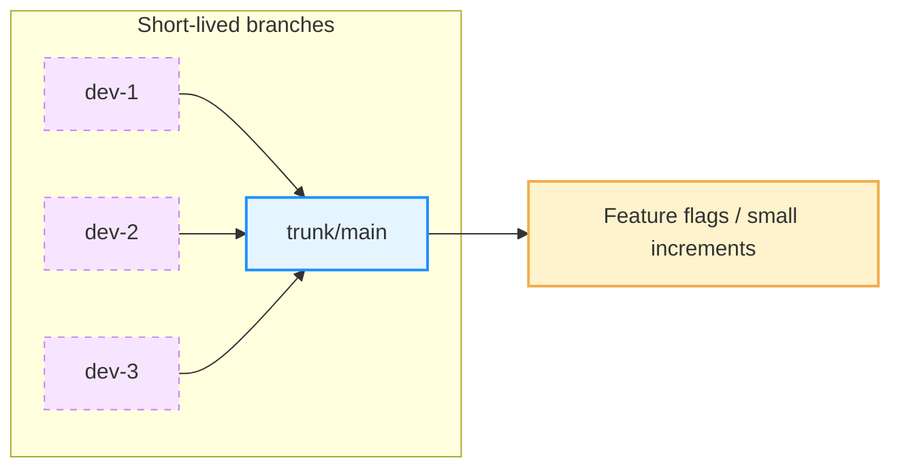

---
# You can also start simply with 'default'
theme: seriph
# background image
background: /centro_arangoya.jpg
# slide metadata
author: Kevin Cifuentes
title: Git Essentials
info: |
  ## Git Essentials
  A practical guide to Git and GitHub: feature-branch flow and basics.
# apply unocss classes to the current slide
class: text-center
favicon: /favicon.png
# drawings config
drawings:
  persist: false
# slide transition: https://sli.dev/guide/animations.html#slide-transitions
transition: slide-left
# enable MDC Syntax: https://sli.dev/features/mdc
mdc: true
lineNumbers: true
---

# Git Essentials

Master the basics of Git and GitHub


<div class="abs-br m-6 text-xl">
  <a href="https://git-scm.com/" target="_blank" class="slidev-icon-btn">
    <carbon:logo-github />
  </a>
</div>

---
layout: cover
---

<div class="abs-tr m-6 text-xl">
  <a href="https://wwww.arangoya.org" target="_blank" class="slidev-icon-btn">
    
  </a>
</div>

# What is <b>Git</b>?

- Distributed version control system
- Tracks changes to files and coordinates work among developers
- Works locally and with remotes (e.g., GitHub, GitLab)

<div class="abs-br m-6 text-xl">
  <SlideCurrentNo />
</div>

---
layout: center
transition: fade
---

<div class="abs-tr m-6 text-xl">
  <a href="https://git-scm.com/downloads" target="_blank" class="slidev-icon-btn">
    
  </a>
</div>

# Install Git

```bash
# Linux (Debian/Ubuntu)
sudo apt update && sudo apt install -y git

# macOS (Homebrew)
brew install git

# Windows (winget)
winget install --id Git.Git -e --source winget

# Verify
git --version
```

- Alternatively, download installers from [git-scm.com/downloads](https://git-scm.com/downloads)

<div class="abs-br m-6 text-xl">
  <SlideCurrentNo />
</div>

---
layout: center
transition: fade
---

<div class="abs-tr m-6 text-xl">
  <a href="https://git-scm.com/book/en/v2/Getting-Started-First-Time-Git-Setup" target="_blank" class="slidev-icon-btn">
    
  </a>
</div>

# First-time setup

```bash
# Identify yourself (once per machine)
git config --global user.name "Your Name"
git config --global user.email "you@example.com"

# Optional: better default branch name
git config --global init.defaultBranch main

# Optional: colorful, concise logs
git config --global color.ui auto
git config --global core.editor "code --wait"   # or vim, nano, etc.
```

<div class="abs-br m-6 text-xl">
  <SlideCurrentNo />
</div>

---
layout: two-cols
transition: fade
---

# Create a repo <b>or</b> clone from GitHub

:::left::

## Create new repository (local)

```bash
mkdir my-project && cd my-project
git init
# add a file
printf "# My Project\n" > README.md
git add README.md
git commit -m "chore: initialize repository"
```

## Add a remote (later)
```bash
git remote add origin git@github.com:org/my-project.git
```

:::right::

## Clone existing repository

```bash
# SSH (recommended if you set up SSH keys)
git clone git@github.com:org/my-project.git

# HTTPS
git clone https://github.com/org/my-project.git
```


<div class="abs-br m-6 text-xl">
  <SlideCurrentNo />
</div>

---
layout: full
transition: slide-up
---

# Feature-Branch Flow (overview)

```mermaid {theme: 'neutral', scale: 0.95}
flowchart LR
  A[main] -->|branch from| B[feature/awesome]
  B --> C[commit 1]
  C --> D[commit 2]
  D --> E[push to origin]
  E --> F[Open Pull Request]
  F --> G[Code Review]
  G --> H[Merge to main]
  H --> I[Delete branch]

  style A fill:#e5f5ff,stroke:#1e90ff,stroke-width:2px
  style B fill:#f7e5ff,stroke:#c57eff,stroke-width:2px,stroke-dasharray: 5 5
  style H fill:#e5f5ff,stroke:#1e90ff,stroke-width:2px
```



- Short-lived branches off `main`
- Commit locally, push, open PR, review, merge, delete branch

<div class="abs-br m-6 text-xl">
  <SlideCurrentNo />
</div>

---
layout: center
transition: fade
---

# Create and remove branches

```bash
# Create and switch to a new branch (modern)
git switch -c feature/awesome

# Equivalent (older)
git checkout -b feature/awesome

# List branches
git branch

# Delete local branch (merged)
git branch -d feature/awesome
# Force delete local branch (unmerged)
git branch -D feature/awesome

# Delete remote branch
git push origin --delete feature/awesome
```

<div class="abs-br m-6 text-xl">
  <SlideCurrentNo />
</div>

---
layout: center
transition: fade
---

# Make changes and commit

```bash
# Stage files
git add file1.ts file2.ts
# or everything modified
git add -A

# Commit with a clear message
git commit -m "feat(login): enable OAuth sign-in"

# Amend the last commit (message only)
git commit --amend -m "feat(login): enable OAuth sign-in (GitHub)"
```

- Prefer conventional messages: `type(scope): summary`
  - Common types: `feat`, `fix`, `chore`, `docs`, `refactor`, `test`

<div class="abs-br m-6 text-xl">
  <SlideCurrentNo />
</div>

---
layout: center
transition: fade
---

# Inspect changes and history

```bash
# What changed (not staged)
git diff
# What is staged
git diff --cached

# Concise, beautiful log
git log --oneline --graph --decorate --all

# Who last changed each line (blame)
git blame path/to/file
```

<div class="abs-br m-6 text-xl">
  <SlideCurrentNo />
</div>

---
layout: two-cols
transition: slide-up
---

# Sync with remote: <b>push</b> and <b>pull</b>

:::left::

## Push your branch
```bash
git push -u origin feature/awesome
# next pushes
git push
```

## Update your branch
```bash
# Rebase keeps history linear (recommended)
git pull --rebase
```

:::right::

## Keep `main` fresh locally
```bash
git switch main
git pull --rebase
```

## Fetch without merging
```bash
git fetch origin
# then inspect & merge/rebase manually
```


<div class="abs-br m-6 text-xl">
  <SlideCurrentNo />
</div>

---
layout: image-right
transition: fade
image: /git.png
---

# Open a Pull Request (GitHub)

1. Push your branch: `git push -u origin feature/awesome`
2. Go to your repository on GitHub → Compare & pull request
3. Fill title/description, link issues, request reviewers
4. Ensure checks pass (CI)
5. Merge: Squash (recommended), Merge, or Rebase
6. Delete the branch

<div class="text-sm mt-4">
<b>Tip</b>: Prefer <b>Squash & merge</b> for clean history on `main`.
</div>

<div class="abs-br m-6 text-xl">
  <SlideCurrentNo />
</div>

---
layout: full
transition: slide-up
---

# Review & Merge


- Automated tests + code review gate changes
- Merge strategy affects history: Squash vs Merge vs Rebase

<div class="abs-br m-6 text-xl">
  <SlideCurrentNo />
</div>

---
layout: center
transition: fade
---

# Revert changes (safe undo)

```bash
# Revert a commit by creating a new inverse commit
git revert <commit-sha>

# Revert a range (inclusive)
git revert <old-sha>^..<new-sha>
```

- Keeps history intact; preferred for shared branches
- Avoid `git reset --hard` on shared branches (rewrites history)

<div class="abs-br m-6 text-xl">
  <SlideCurrentNo />
</div>

---
layout: center
transition: fade
---

# Cherry-pick (copy a commit)

```bash
# Apply a commit from another branch to current branch
git switch release/1.2.x
git cherry-pick <commit-sha>

# Resolve conflicts, then continue
git add -A
git cherry-pick --continue
```

- Useful to backport fixes to release branches

<div class="abs-br m-6 text-xl">
  <SlideCurrentNo />
</div>

---
layout: full
transition: fade
---

# Trunk-based development (contrast)



- Integrate to `main` daily; very short-lived branches
- Rely on feature flags and strong CI

<div class="abs-br m-6 text-xl">
  <SlideCurrentNo />
</div>

---
layout: center
transition: fade
---

# Quick cheat sheet

```bash
# setup
git config --global user.name "Name"
git config --global user.email "you@x.com"

# start
git init
# or
git clone <url>

# branches
git switch -c feature/x
# delete branch (after merge)
git branch -d feature/x

# stage & commit
git add -A
git commit -m "feat(x): ..."

# history
git log --oneline --graph --decorate --all

# sync
git push -u origin HEAD
# later
git pull --rebase

# PR (GitHub) → open, review, merge

# undo
git revert <sha>

# cherry-pick
git cherry-pick <sha>
```

<div class="abs-br m-6 text-xl">
  <SlideCurrentNo />
</div>

---
layout: center
transition: fade
---

# Resources

- Pro Git (Scott Chacon, Ben Straub) — [git-scm.com/book](https://git-scm.com/book)
- Atlassian Git Tutorials — [atlassian.com/git](https://www.atlassian.com/git)
- GitHub Docs — [docs.github.com](https://docs.github.com/)

<div class="abs-br m-6 text-xl">
  <SlideCurrentNo />
</div> 