---
# You can also start simply with 'default'
theme: seriph
# background image
background: /centro_arangoya.jpg
# slide metadata
author: Kevin Cifuentes
title: Maximizing Human Contribution
info: |
  ## Vibe Coding
  30%: Maximizing Human Contribution - Skills for Programmers in the AI Era
# apply unocss classes to the current slide
class: text-center
favicon: /favicon.png
# drawings config
drawings:
  persist: false
# slide transition: https://sli.dev/guide/animations.html#slide-transitions
transition: slide-left
# enable MDC Syntax: https://sli.dev/features/mdc
mdc: true
lineNumbers: true
---

# Vibe Coding

## 30%: Maximizing Human Contribution


<div class="abs-br m-6 text-xl">
  <a href="https://github.com/Kevincifuentes/VibeCoding" target="_blank" class="slidev-icon-btn">
    <carbon:logo-github />
  </a>
</div>

<!-- Portada: el 30% que hace la diferencia. Habilidades humanas en la era de la IA. -->

---
layout: section
transition: fade-out
---

<div class="abs-tr m-6 text-xl">
  <a href="https://wwww.arangoya.org" target="_blank" class="slidev-icon-btn">
    
  </a>
</div>

# The New Coding Landscape 🌍

<div class="abs-br m-6 text-xl">
  <SlideCurrentNo />
</div>

<!--
El panorama ha cambiado: la IA maneja mucho del trabajo rutinario, pero el rol del desarrollador evoluciona, no desaparece.
-->

---
layout: two-cols-header
transition: fade
---

<div class="abs-tr m-6 text-xl">
  <a href="https://wwww.arangoya.org" target="_blank" class="slidev-icon-btn">
    
  </a>
</div>

# The New Coding Landscape 🌍

::left::

## What AI handles well:

<div class="text-sm">

- ✅ **Boilerplate code** - repetitive patterns
- ✅ **Routine implementations** - standard CRUD
- ✅ **Code scaffolding** - initial structure
- ✅ **Simple refactoring** - basic improvements
- ✅ **Documentation generation** - comments and docs

</div>

<br>
<br>
<br>
<br>
<br>
<br>

::right::

## What remains human territory:

<div class="text-sm">

- 🧠 **Complex requirements** - understanding nuance
- 🏗️ **System architecture** - maintainable design
- 🔍 **Edge cases** - thinking about what breaks
- ✓ **Correctness verification** - ensuring it works
- 🎯 **Business alignment** - solving real problems

</div>

<div class="abs-br m-6 text-xl">
  <SlideCurrentNo />
</div>

<!--
Los asistentes transforman el desarrollo manejando boilerplate y trabajo rutinario. 

El desafío está en el tramo final: entender requisitos complejos, arquitectar sistemas mantenibles, manejar casos extremos y asegurar corrección. La programación no termina; el rol del desarrollador evoluciona, no desaparece.
-->

---
layout: center
transition: slide-up
---

<div class="abs-tr m-6 text-xl">
  <a href="https://wwww.arangoya.org" target="_blank" class="slidev-icon-btn">
    
  </a>
</div>

<div class="text-center">

# Programming is *evolving*, not disappearing 📈

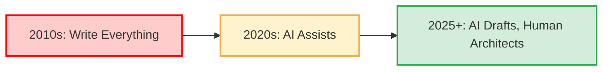

<div class="mt-8 text-lg">

**The role is transforming:** from *code writer* to **architect, reviewer, and decision-maker**

</div>

</div>

<div class="abs-br m-6 text-xl">
  <SlideCurrentNo />
</div>

<!--
La evolución del rol: de escribir cada línea a ser arquitecto, revisor y quien toma decisiones estratégicas.
-->

---
layout: section
transition: fade
---

<div class="abs-tr m-6 text-xl">
  <a href="https://wwww.arangoya.org" target="_blank" class="slidev-icon-btn">
    
  </a>
</div>

# Why Human Skills Matter More Than Ever 🎯

<div class="abs-br m-6 text-xl">
  <SlideCurrentNo />
</div>

<!--
Las habilidades humanas son ahora más valiosas que nunca porque complementan lo que la IA no puede hacer.
-->

---
layout: two-cols
transition: fade
---

<div class="abs-tr m-6 text-xl">
  <a href="https://wwww.arangoya.org" target="_blank" class="slidev-icon-btn">
    
  </a>
</div>

# Why Human Skills Matter More Than Ever

## Where AI Struggles:

<div class="text-sm mt-4">

### 🧠 Engineering Judgment
- Choosing between multiple valid solutions
- Understanding trade-offs (performance vs. maintainability)
- Making nuanced architectural decisions

### 🎭 Context & Intuition
- Reading between the lines of vague requirements
- Understanding organizational politics and constraints
- Anticipating future needs and changes

### 🔗 System Thinking
- Seeing how pieces fit together
- Understanding downstream impacts
- Predicting cascading failures

</div>

::right::
<br>
<br>
<br>
<br>

<div class="mt-16">

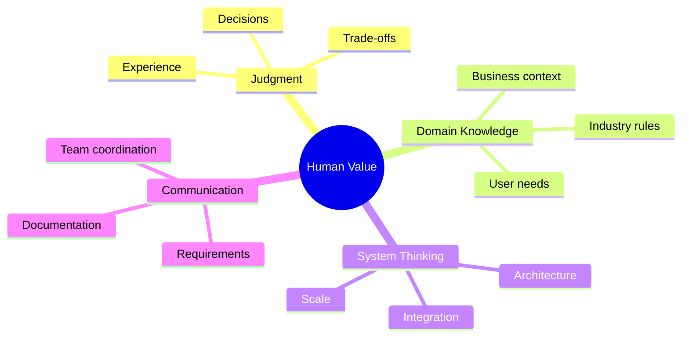

</div>

<div class="abs-br m-6 text-xl">
  <SlideCurrentNo />
</div>

<!--
La IA sigue teniendo carencias y toma decisiones "matizadas".

¿Cómo podemos ser mejores? El éxito significa abrazar lo que la IA hace mejor mientras duplicamos la apuesta en habilidades humanas duraderas e insights. 

Desarrolladores senior y mid-level deben aprender a amplificar su conocimiento de dominio, intuición y toma de decisiones junto con herramientas de IA.
-->

---
layout: quote
transition: slide-up
---

<div class="abs-tr m-6 text-xl">
  <a href="https://wwww.arangoya.org" target="_blank" class="slidev-icon-btn">
    
  </a>
</div>

# "Success means embracing what AI does best while **doubling down on durable human skills** and insights"

<div class="abs-br m-6 text-xl">
  <SlideCurrentNo />
</div>

<!--
Cita clave: el éxito está en combinar lo mejor de ambos mundos.
-->

---
layout: section
transition: fade
---

<div class="abs-tr m-6 text-xl">
  <a href="https://wwww.arangoya.org" target="_blank" class="slidev-icon-btn">
    
  </a>
</div>

# Maximizing Value as a 
# 👶/🧒/👴🏻 Developer 

<div class="abs-br m-6 text-xl">
  <SlideCurrentNo />
</div>

<!--
Cómo los juniors/mid/seniors pueden maximizar su impacto en la era de la IA.
-->

---
layout: two-cols-header
transition: fade
---

<div class="abs-tr m-6 text-xl">
  <a href="https://wwww.arangoya.org" target="_blank" class="slidev-icon-btn">
    
  </a>
</div>

# The New Role 🎯

::left::

## Architect & 
## Editor-in-Chief 📐

<div class="text-sm">

- **AI handles first drafts** ✍️
  - Initial implementations
  - Boilerplate and scaffolding
  - Common patterns

- **You focus on** 🔍:
  - High-level architecture
  - Critical code review
  - Design patterns and decisions
  - Cross-cutting concerns
  - Technical debt management

</div>

::right::

## Quality 
## Guardian 🛡️

<div class="text-sm">

- **Set Standards** 📏:
  - Code quality benchmarks
  - Security requirements
  - Performance targets
  - Testing coverage

- **Mentor the Team** 👥:
  - How to review AI code
  - Testing strategies
  - Questioning AI suggestions
  - Building judgment skills

</div>

<div class="abs-br m-6 text-xl">
  <SlideCurrentNo />
</div>

<!--
Nos convertimos en arquitectos y editores jefe: dejamos que la IA maneje borradores iniciales, nos enfocamos en arquitectura de alto nivel y revisión crítica. 

Establecen y mantienen altos estándares de calidad, seguridad y rendimiento. Mentorizan y entrenan miembros menos experimentados sobre cómo revisar, testear y cuestionar trabajo generado por IA.
-->

---
layout: center
transition: slide-up
---

<div class="abs-tr m-6 text-xl">
  <a href="https://wwww.arangoya.org" target="_blank" class="slidev-icon-btn">
    
  </a>
</div>

# The Senior Developer Evolution 🚀

<div class="flex justify-center items-center w-full">

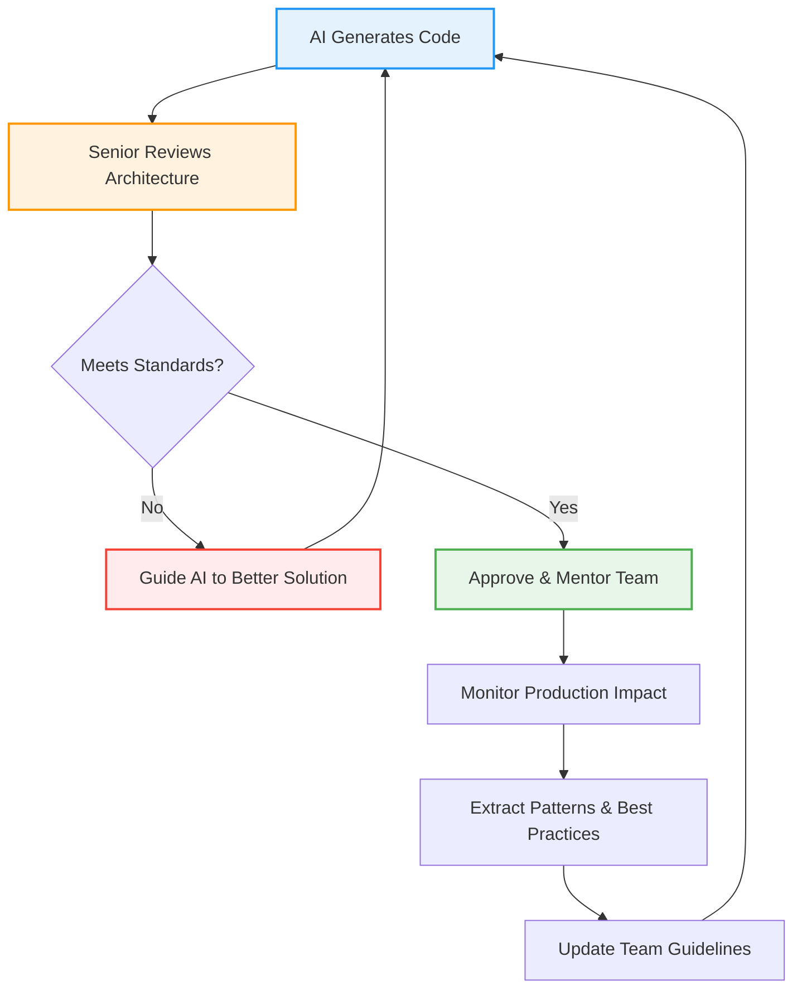

</div>

<div class="abs-br m-6 text-xl">
  <SlideCurrentNo />
</div>

<!--
El ciclo del senior: revisar, guiar, mentorizar y mejorar continuamente los procesos y estándares del equipo.
-->

---
layout: section
transition: fade
---

<div class="abs-tr m-6 text-xl">
  <a href="https://wwww.arangoya.org" target="_blank" class="slidev-icon-btn">
    
  </a>
</div>

# Key Durable Skills for All Levels 💪

<div class="abs-br m-6 text-xl">
  <SlideCurrentNo />
</div>

<!--
Las habilidades duraderas que todo desarrollador debe cultivar, independientemente del nivel.
-->

---
layout: full
transition: fade
---

<div class="abs-tr m-6 text-xl">
  <a href="https://wwww.arangoya.org" target="_blank" class="slidev-icon-btn">
    
  </a>
</div>

# The Four Pillars of Durable Skills 🏛️

<div class="grid grid-cols-2 gap-3 text-xs leading-tight">

<div class="bg-blue-50 p-3 rounded-lg">

**🧠 Critical Thinking**  
Enumerate edge cases • Anticipate failures • Address ambiguities • Question assumptions

<div class="text-[10px] mt-1 italic">
Example: AI generates user authentication. Do you ask: What happens if the database is down? How do we handle concurrent sessions? What about password reset edge cases?
</div>

</div>

<div class="bg-green-50 p-3 rounded-lg">

**🎯 Domain Expertise**  
Deep understanding of business context • User behavior • Regulatory requirements • Industry constraints

<div class="text-[10px] mt-1 italic">
Example: Building a payment system: Know PCI-DSS compliance rules • Understand refund workflows • Handle currency conversion edge cases • Consider fraud prevention
</div>

</div>

<div class="bg-orange-50 p-3 rounded-lg">

**⚡ Performance Tuning**  
AI suggests simple optimizations • You handle advanced troubleshooting • Broad stack knowledge • Real-world profiling

<div class="text-[10px] mt-1 italic">
Example: Slow API endpoint: Profile to find bottleneck (not guess) • Understand database query plans • Know when to cache vs. optimize • Consider network and concurrency
</div>

</div>

<div class="bg-purple-50 p-3 rounded-lg">

**✅ Testing & Review**  
Treat AI code like junior developer output • Thorough reviews mandatory • Strong unit/integration testing • Think about what could break

<div class="text-[10px] mt-1 italic">
Example: AI generates data processing: Test with empty datasets • Test with malformed input • Test boundary conditions • Verify error handling
</div>

</div>

</div>

<div class="abs-br m-6 text-xl">
  <SlideCurrentNo />
</div>

<!--
- Pensamiento crítico: enumerar casos extremos, anticipar fallos, abordar ambigüedades. 

- Expertise de dominio: entendimiento profundo del negocio, usuarios y contexto regulatorio descubre problemas que la IA puede perder. 

- Rendimiento: la IA puede sugerir optimizaciones simples, pero troubleshooting avanzado depende de conocimiento amplio del stack. 

- Testing y code review: tratar código de IA como output de junior humano, revisiones exhaustivas y testing fuerte requerido.
-->

---
layout: two-cols-header
transition: slide-up
---

<div class="abs-tr m-6 text-xl">
  <a href="https://wwww.arangoya.org" target="_blank" class="slidev-icon-btn">
    
  </a>
</div>

# Real-World Example: Critical Thinking in Action 🎬

::left::

## ❌ Without Critical Thinking:

<div class="text-sm mt-4">

```javascript
// AI-generated user search
async function searchUsers(query) {
  const users = await db.query(
    `SELECT * FROM users 
     WHERE name LIKE '%${query}%'`
  );
  return users;
}
```

**Accepted without review** ✓

<v-click>

**Problems**:
- SQL injection vulnerability 🚨
- No pagination (could return millions) 💥
- No input validation 🔓
- Full table scan on large datasets 🐌

</v-click>

</div>

::right::

<v-click>

## ✅ With Critical Thinking:

<div class="text-sm mt-4">

```javascript
// Reviewed and improved
async function searchUsers(query, page = 1) {
  // Input validation
  if (!query || query.length < 2) {
    throw new Error('Query too short');
  }
  
  const limit = 50;
  const offset = (page - 1) * limit;
  
  // Parameterized query (no SQL injection)
  const users = await db.query(
    `SELECT id, name, email 
     FROM users 
     WHERE name ILIKE $1 
     LIMIT $2 OFFSET $3`,
    [`%${query}%`, limit, offset]
  );
  
  return users;
}
```

</div>

</v-click>

<div class="abs-br m-6 text-xl">
  <SlideCurrentNo />
</div>

<!--
Ejemplo real de cómo el pensamiento crítico transforma código aceptable en código robusto y seguro.
-->

---
layout: section
transition: fade
---

<div class="abs-tr m-6 text-xl">
  <a href="https://wwww.arangoya.org" target="_blank" class="slidev-icon-btn">
    
  </a>
</div>

# Cultivating Breadth: Specialization and System Thinking 🌳

<div class="abs-br m-6 text-xl">
  <SlideCurrentNo />
</div>

<!--
A medida que las tareas rutinarias se automatizan, el valor cambia hacia conocimiento especializado y pensamiento de sistemas.
-->

---
layout: two-cols
transition: fade
---

<div class="abs-tr m-6 text-xl">
  <a href="https://wwww.arangoya.org" target="_blank" class="slidev-icon-btn">
    
  </a>
</div>

# From Trees to Forests 
# 🌲➡️🌳🌳🌳

<br>

## The Value Shift:

<div class="text-sm mt-4">

### Old Focus: Writing Code
- Individual functions
- Isolated features
- "Making it work"

### New Focus: System Design
- **How components interact** 🔗
- **API contracts and boundaries** 📋
- **Data flow and state management** 💾
- **Distributed system patterns** 🌐
- **Ripple effects of changes** 🌊

</div>

::right::

<div class="mt-8">

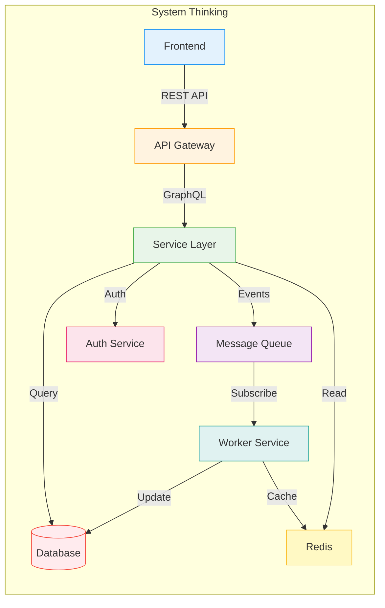

<div class="text-sm mt-4">

**Strong software** is built by those who see the **whole system**, not just individual pieces

</div>

</div>

<div class="abs-br m-6 text-xl">
  <SlideCurrentNo />
</div>

<!--
Lo dicho, a medida que tareas rutinarias se automatizan, el valor cambia a conocimiento especializado y entender límites del sistema (APIs, modelos de datos, diseño distribuido). 

Construir software requiere más que código: se trata de entender cómo los cambios se propagan a través del sistema completo. Software fuerte es construido por quienes ven el bosque, no solo los árboles.
-->

---
layout: center
transition: slide-up
---

<div class="abs-tr m-6 text-xl">
  <a href="https://wwww.arangoya.org" target="_blank" class="slidev-icon-btn">
    
  </a>
</div>

# Example: Understanding System Boundaries 🎯

<div class="text-sm mt-6">

## Scenario: Adding a "Delete User" Feature

### 🤖 AI Might Generate:

```javascript
async function deleteUser(userId) {
  await db.query('DELETE FROM users WHERE id = ?', [userId]);
  return { success: true };
}
```

<v-click>

### 🧠 System Thinking Asks:

<div class="grid grid-cols-2 gap-4 mt-4">


<div>

- What about user's posts/comments? 🗨️
- Should we cascade delete or orphan?
- Are there foreign key constraints?
- What about audit logs? 📝

</div>

<div>

- Active sessions need invalidation? 🔐
- External services to notify? 📧
- GDPR compliance (data export)? ⚖️
- Can we soft-delete instead? 🗑️

</div>

</div>

</v-click>

<br>

<v-click>

### ✅ Complete Solution Considers:
Multiple services, data consistency, compliance, user experience, and rollback scenarios

</v-click>

</div>

<div class="abs-br m-6 text-xl">
  <SlideCurrentNo />
</div>

<!--
Ejemplo práctico de cómo el pensamiento de sistemas revela la complejidad real detrás de operaciones aparentemente simples.
-->

---
layout: section
transition: fade
---

<div class="abs-tr m-6 text-xl">
  <a href="https://wwww.arangoya.org" target="_blank" class="slidev-icon-btn">
    
  </a>
</div>

# Junior Developers—How To Thrive 👶

<div class="abs-br m-6 text-xl">
  <SlideCurrentNo />
</div>

<!--
Consejos específicos para desarrolladores junior sobre cómo prosperar en la era de la IA.
-->

---
layout: two-cols-header
transition: fade
---

<div class="abs-tr m-6 text-xl">
  <a href="https://wwww.arangoya.org" target="_blank" class="slidev-icon-btn">
    
  </a>
</div>

# The Junior Developer Path 🛤️

::left::

## ⚠️ The Trap to Avoid:

<div class="text-sm mt-4">

### Using AI as a Crutch
- Copy-paste without understanding
- Never struggling with problems
- Missing fundamental concepts
- "It works" = good enough

### The Result:
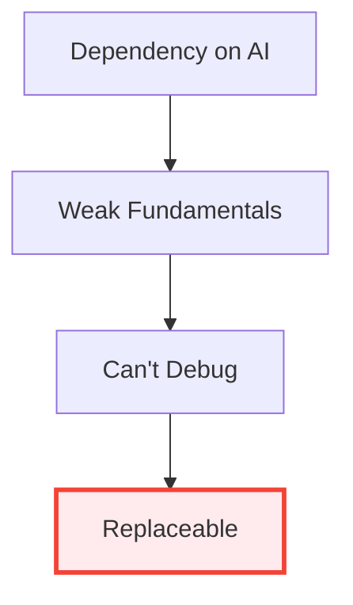

</div>

::right::

## ✅ The Path to Success:

<div class="text-sm mt-4">

### Build Strong Foundations 🏗️
1. **Learn fundamentals deeply**
   - Data structures & algorithms
   - Design patterns
   - Core language features

2. **Practice without AI** (deliberately)
   - Solve problems independently
   - Debug without assistance
   - Read others' code

3. **Use AI strategically**
   - Accelerate after understanding
   - Learn from AI explanations
   - Compare your solution to AI's

4. **Master the craft**
   - Code review skills
   - Architectural patterns
   - Write maintainable code

</div>

<div class="abs-br m-6 text-xl">
  <SlideCurrentNo />
</div>

<!--
- Aprender fundamentos profundamente; no usar IA como muleta para cada pregunta. 

- Practicar resolución de problemas y debugging sin la red de seguridad de IA para construir confianza. 

- Dominar code review, entender patrones arquitectónicos y desarrollar soluciones mantenibles, no solo "hacer que funcione".
-->

---
layout: center
transition: slide-up
---

<div class="abs-tr m-6 text-xl">
  <a href="https://wwww.arangoya.org" target="_blank" class="slidev-icon-btn">
    
  </a>
</div>

# The 80/20 Rule for Juniors 📊

<div class="grid grid-cols-2 gap-6 mt-4 text-sm">

<div class="bg-red-50 p-4 rounded-lg border-2 border-red-300">

## ❌ DON'T: 100% AI-Powered

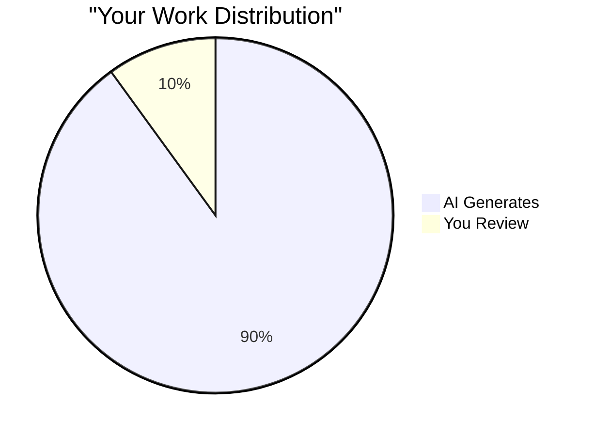

**Problems:**
- Shallow understanding
- Can't explain your code
- Stuck when AI is wrong
- No problem-solving muscle

</div>

<div class="bg-green-50 p-4 rounded-lg border-2 border-green-300">

## ✅ DO: Balanced Approach

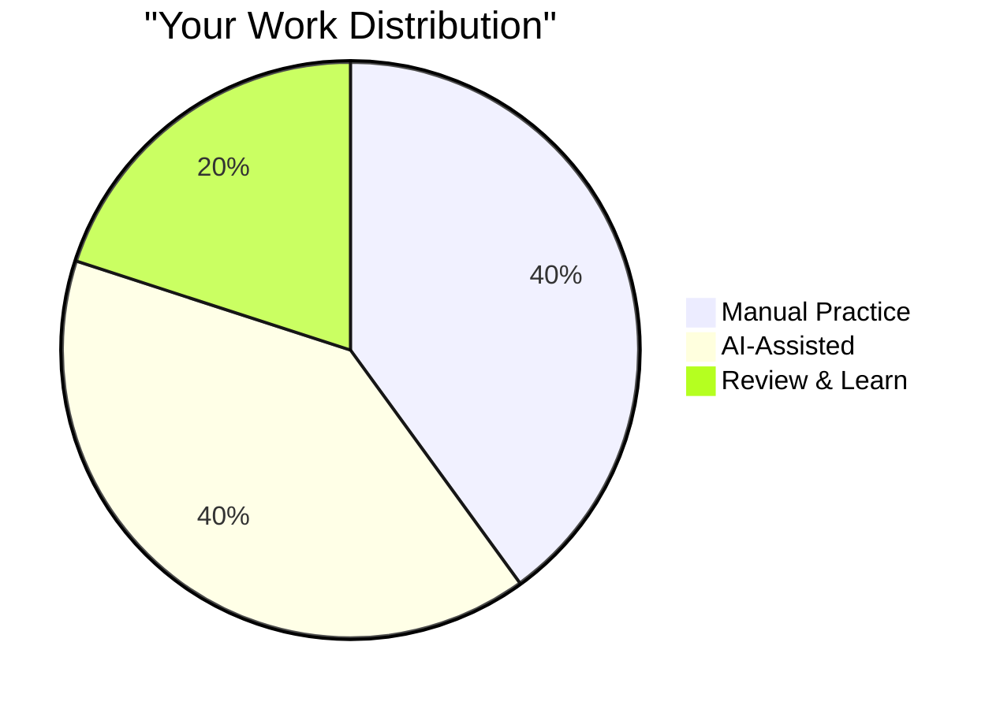

**Benefits:**
- Deep understanding ✓
- Can debug anything ✓
- Strong fundamentals ✓
- AI amplifies your skills ✓

</div>

</div>

<div class="abs-br m-6 text-xl">
  <SlideCurrentNo />
</div>

<!--
La regla 80/20 para juniors: equilibrar trabajo manual, asistencia de IA y aprendizaje deliberado.
-->

---
layout: full
transition: fade
---

<div class="abs-tr m-6 text-xl">
  <a href="https://wwww.arangoya.org" target="_blank" class="slidev-icon-btn">
    
  </a>
</div>

# Practical Exercise for Juniors 💻

<div class="text-xs mt-4">

## The "Learn Before AI" Challenge

### Week 1-2: Build Without AI 🚫🤖
**Task**: Build a simple TODO app with authentication
- Research and implement yourself
- Struggle with problems (it's good!)
- Debug errors independently
- Document what you learned

### Week 3-4: Rebuild With AI 🤖✓
**Task**: Build the same app using AI assistance
- Compare approaches
- See what AI does differently
- Understand why AI chose certain patterns
- Identify what you learned from struggle

### Reflection Questions:
1. What concepts were easier to understand after struggling first?
2. Where did AI provide unexpected insights?
3. What mistakes did you make that AI avoided (or didn't)?
4. Can you explain both solutions completely?

</div>

<div class="abs-br m-6 text-xl">
  <SlideCurrentNo />
</div>

<!--
Ejercicio práctico que ayuda a los juniors a construir fundamentos antes de depender de la IA.
-->

---
layout: section
transition: fade
---

<div class="abs-tr m-6 text-xl">
  <a href="https://wwww.arangoya.org" target="_blank" class="slidev-icon-btn">
    
  </a>
</div>

# Testing, Verification, and Maintenance 🧪

<div class="abs-br m-6 text-xl">
  <SlideCurrentNo />
</div>

<!--
La importancia crítica de testing y verificación cuando se trabaja con código generado por IA.
-->

---
layout: two-cols-header
transition: fade
---

<div class="abs-tr m-6 text-xl">
  <a href="https://wwww.arangoya.org" target="_blank" class="slidev-icon-btn">
    
  </a>
</div>

# The Testing Mindset 🎯

::left::

## Why Testing is Critical with AI:

<div class="text-sm mt-4">

### 🤖 AI Code Looks Good...
- Syntactically correct ✓
- Follows common patterns ✓
- Often runs without errors ✓

### ⚠️ ...But May Hide Issues:

- **Edge cases not handled** 🐛
  - Empty arrays, null values
  - Boundary conditions
  - Concurrent access

- **Incorrect assumptions** 🤔
  - Misunderstood requirements
  - Wrong algorithms
  - Performance issues

- **Security vulnerabilities** 🔒
  - Input not validated
  - Authentication bypassed
  - Data exposed

</div>

::right::

## The Testing Pyramid for AI Code:

<div class="mt-4">

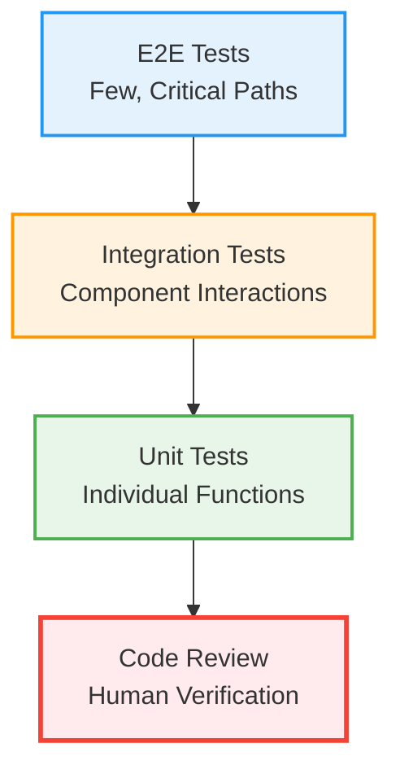

<div class="text-sm mt-6">

### Golden Rules:
1. **Always write tests** for AI code
2. **Test edge cases** explicitly
3. **Run tests** before committing
4. **Review coverage** regularly

</div>

</div>

<div class="abs-br m-6 text-xl">
  <SlideCurrentNo />
</div>

<!--
- Siempre escribir y ejecutar tests para código generado por IA. 

- La verificación entrena para esperar y verificar comportamiento correcto y de casos extremos. 

- Priorizar mantenimiento y legibilidad; 

- Refactorizar proactivamente output de IA para claridad y sostenibilidad a largo plazo.
-->

---
layout: center
transition: slide-up
---

<div class="abs-tr m-6 text-xl">
  <a href="https://wwww.arangoya.org" target="_blank" class="slidev-icon-btn">
    
  </a>
</div>

# Real Example: AI Code That "Works" 🎭

<div class="grid grid-cols-2 gap-6 mt-6 text-sm">

<div>

### AI-Generated Function:
```javascript
function calculateDiscount(price, coupon) {
  if (coupon === "SAVE10") {
    return price * 0.9;
  }
  if (coupon === "SAVE20") {
    return price * 0.8;
  }
  return price;
}
```

### Manual Test:
```javascript
// Seems to work!
console.log(calculateDiscount(100, "SAVE10")); 
// 90 ✓
```

</div>

<v-click>
<div>

### Edge Cases to Test:
```javascript
// What about these?
calculateDiscount(100, null);          // 💥
calculateDiscount(100, "");            // 🤔
calculateDiscount(-100, "SAVE10");     // ❌
calculateDiscount("100", "SAVE10");    // 🤔
calculateDiscount(Infinity, "SAVE10"); // 💥🤔
calculateDiscount(100, "save10");      // Case sensitivity?
```

### Better Implementation:
```javascript
function calculateDiscount(price, coupon) {
  // Validation
  if (typeof price !== 'number' || price < 0) {
    throw new Error('Invalid price');
  }
  if (!coupon || typeof coupon !== 'string') {
    return price;
  }
  
  const discounts = {
    'SAVE10': 0.1,
    'SAVE20': 0.2
  };
  
  const discount = discounts[coupon.toUpperCase()] || 0;
  return price * (1 - discount);
}
```

</div>

</v-click>

</div>

<div class="abs-br m-6 text-xl">
  <SlideCurrentNo />
</div>

<!--
Ejemplo real de cómo código que "funciona" puede fallar en producción sin testing adecuado.
-->

---
layout: section
transition: fade
---

<div class="abs-tr m-6 text-xl">
  <a href="https://wwww.arangoya.org" target="_blank" class="slidev-icon-btn">
    
  </a>
</div>

# Prompting and Tooling Skills 🛠️

<div class="abs-br m-6 text-xl">
  <SlideCurrentNo />
</div>

<!--
Desarrollar habilidades de prompting es ahora una competencia diferenciadora clave.
-->

---
layout: center
transition: slide-up
---

<div class="abs-tr m-6 text-xl">
  <a href="https://wwww.arangoya.org" target="_blank" class="slidev-icon-btn">
    
  </a>
</div>

# The Prompt Engineering Skill Ladder 🪜

<div class="flex justify-center items-center mt-8">

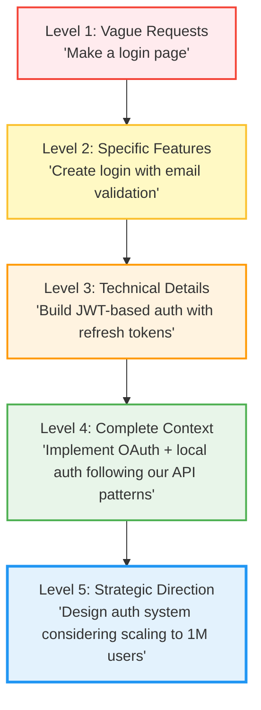

</div>

<div class="text-center mt-8 text-lg">

**Your goal**: Climb to Level 4-5 where prompts become **architectural conversations**

</div>

<div class="abs-br m-6 text-xl">
  <SlideCurrentNo />
</div>

<!--
La escalera de habilidades de prompting: desde peticiones vagas hasta conversaciones arquitectónicas estratégicas.
-->

---
layout: section
transition: fade
---

<div class="abs-tr m-6 text-xl">
  <a href="https://wwww.arangoya.org" target="_blank" class="slidev-icon-btn">
    
  </a>
</div>

# The Amplified Role of Communication 💬

<div class="abs-br m-6 text-xl">
  <SlideCurrentNo />
</div>

<!--
La comunicación se vuelve aún más valiosa cuando el tiempo de implementación disminuye.
-->

---
layout: two-cols-header
transition: fade
---

<div class="abs-tr m-6 text-xl">
  <a href="https://wwww.arangoya.org" target="_blank" class="slidev-icon-btn">
    
  </a>
</div>

# Communication: The Ultimate Differentiator 🎯

::left::

## Why Communication Matters More Now:

<div class="text-sm mt-4">

### The New Bottleneck:
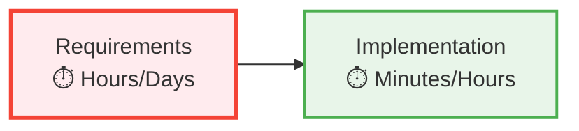

**Before AI**: Implementation was the bottleneck  
**With AI**: Understanding requirements is the bottleneck

### The Skills That Shine:
- 🗣️ **Translating** business needs → technical solutions
- 📝 **Documenting** decisions and rationale
- 👥 **Coordinating** team efforts
- 🤝 **Negotiating** trade-offs with stakeholders
- 📢 **Explaining** technical concepts to non-technical people

</div>

::right::

## Communication in Practice:

<div class="text-sm mt-4">

#### ❌ Poor Communication:
```
Stakeholder: "We need a dashboard"
Developer: *builds generic dashboard*
Stakeholder: "That's not what I meant"
```

**Result**: Wasted time, frustration

#### ✅ Strong Communication:
```
Stakeholder: "We need a dashboard"

Developer asks:
- What metrics matter most?
- Who's the audience?
- What decisions will this enable?
- How often will it be viewed?
- What's the data refresh cadence?
- Any performance constraints?
```

**Result**: Success, trust, efficiency

</div>

<div class="abs-br m-6 text-xl">
  <SlideCurrentNo />
</div>

<!--
- Traducir entre necesidades de negocio y soluciones técnicas es aún más valioso cuando el tiempo de implementación cae.

- Comunicación fuerte, documentación y trabajo en equipo aseguran que desarrollo asistido por IA se mantenga en el camino correcto. 

- Buscar feedback, mentorizar otros y mantenerse receptivo para aprender de experiencia colectiva.
-->

---
layout: center
transition: slide-up
---

<div class="abs-tr m-6 text-xl">
  <a href="https://wwww.arangoya.org" target="_blank" class="slidev-icon-btn">
    
  </a>
</div>

# The Communication Multiplier Effect 📈

<div class="grid grid-cols-3 gap-6 mt-10 text-sm">

<div class="bg-red-50 p-6 rounded-lg">

### 😞 Weak Communication

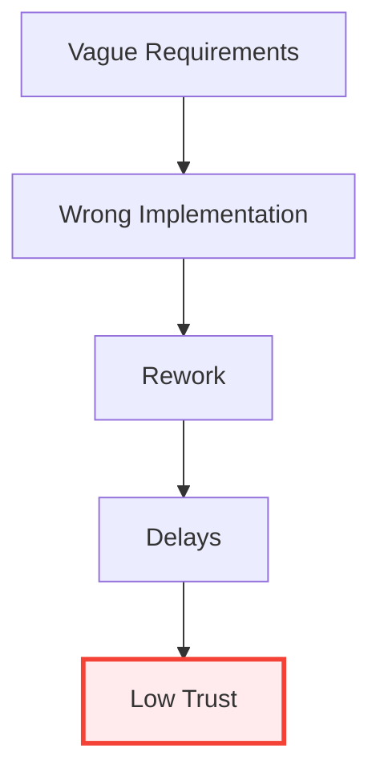

**Outcome**: Slow, frustrating, expensive

</div>

<div class="bg-yellow-50 p-6 rounded-lg">

### 😐 OK Communication

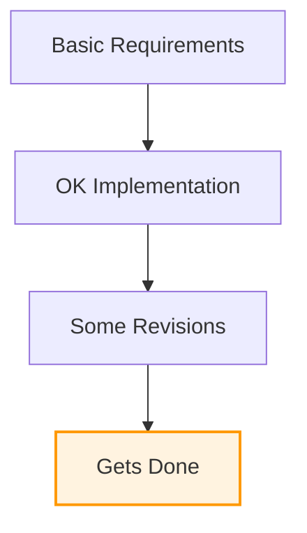

**Outcome**: Works eventually, nothing special

</div>

<div class="bg-green-50 p-6 rounded-lg">

### 🎯 Excellent Communication

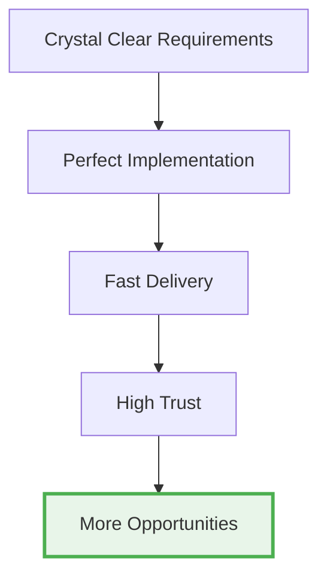

**Outcome**: Fast, efficient, career accelerator

</div>

</div>

<div class="abs-br m-6 text-xl">
  <SlideCurrentNo />
</div>

<!--
El efecto multiplicador de la comunicación en resultados, velocidad y oportunidades de carrera.
-->

---
layout: section
transition: fade
---

<div class="abs-tr m-6 text-xl">
  <a href="https://wwww.arangoya.org" target="_blank" class="slidev-icon-btn">
    
  </a>
</div>

# Preparing for the Future 🔮

<div class="abs-br m-6 text-xl">
  <SlideCurrentNo />
</div>

<!--
Cómo prepararse para el futuro de la ingeniería de software.
-->

---
layout: center
transition: fade
---

<div class="abs-tr m-6 text-xl">
  <a href="https://wwww.arangoya.org" target="_blank" class="slidev-icon-btn">
    
  </a>
</div>

# The Future of Software Engineering 🚀

<div class="mt-8">

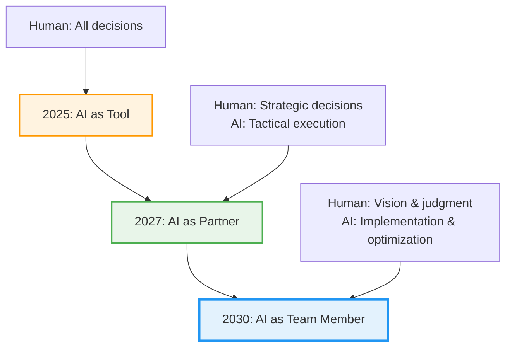

</div>

<div class="mt-8 text-center text-lg">

## The Real Differentiator:

**Those who blend strong fundamentals + system thinking**

**+ communication + leadership with adept AI use**

</div>

<div class="abs-br m-6 text-xl">
  <SlideCurrentNo />
</div>

<!--
El verdadero diferenciador serán aquellos que combinen fundamentos de programación fuertes, pensamiento de sistemas, comunicación y liderazgo con uso hábil de IA. La IA es un multiplicador de fuerza en manos hábiles: aquellos que cultiven ambos superarán a otros.
-->

---
layout: two-cols-header
transition: slide-up
---

<div class="abs-tr m-6 text-xl">
  <a href="https://wwww.arangoya.org" target="_blank" class="slidev-icon-btn">
    
  </a>
</div>

# The Software Engineer of Tomorrow 🌟

<br>

> "Software engineering is, and always will be, about **solving real problems**—not just writing lines of code"

<br>

::left::

## What Won't Change:

<div class="text-sm mt-4">

- **Problem-solving** at the core 🧩
- **Understanding users** and needs 👥
- **System design** and architecture 🏗️
- **Critical thinking** and judgment 🧠
- **Collaboration** and teamwork 🤝
- **Learning and adaptation** 📚
- **Ethical considerations** ⚖️

<br>

</div>

::right::

## What Will Change:

<div class="text-sm mt-4">

- **Tools become more powerful** 🛠️
- **Speed of iteration increases** ⚡
- **Scope of individual impact grows** 📈
- **Communication becomes more critical** 💬
- **Domain expertise valued more** 🎯
- **Leadership skills differentiate** 👑

### Your Competitive Advantage:

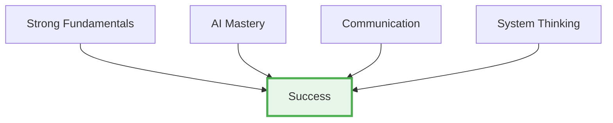

</div>

<div class="abs-br m-6 text-xl">
  <SlideCurrentNo />
</div>

<!--
La IA es multiplicador de fuerza en manos hábiles: aquellos que cultiven ambos superarán a otros. En última instancia, ingeniería de software es, y siempre será, sobre resolver problemas reales, no solo escribir líneas de código.
-->

---
layout: section
transition: fade
---

<div class="abs-tr m-6 text-xl">
  <a href="https://wwww.arangoya.org" target="_blank" class="slidev-icon-btn">
    
  </a>
</div>

# Key Takeaways for Students 🎓

<div class="abs-br m-6 text-xl">
  <SlideCurrentNo />
</div>

<!--
Conclusiones clave que teneis que tener en cuenta para no ser remplazables el día de mañana.
-->

---
layout: full
transition: fade
---

<div class="abs-tr m-6 text-xl">
  <a href="https://wwww.arangoya.org" target="_blank" class="slidev-icon-btn">
    
  </a>
</div>

# Your Action Plan: Becoming an AI-Era Developer 🎯

<br>
<br>
<br>

<div class="grid grid-cols-3 gap-2 text-[10px] leading-tight">

<div class="bg-gradient-to-br from-blue-50 to-blue-100 p-2 rounded border border-blue-300">

**🧠 Master the Fundamentals**

Don't let AI do your thinking • Practice problem-solving without AI • Understand data structures, algorithms, patterns

</div>

<div class="bg-gradient-to-br from-green-50 to-green-100 p-2 rounded border border-green-300">

**🏗️ Build System Thinking**

See the forest, not just trees • Understand how components interact • Think about edge cases and failure modes

</div>

<div class="bg-gradient-to-br from-orange-50 to-orange-100 p-2 rounded border border-orange-300">

**🔍 Develop Critical Thinking**

Question AI suggestions • Review code like a senior developer • Test thoroughly • Ask "why" and "what if"

</div>

<div class="bg-gradient-to-br from-purple-50 to-purple-100 p-2 rounded border border-purple-300">

**🎯 Deepen Domain Knowledge**

Understand your users and business • Learn industry-specific requirements • Know regulatory issues

</div>

<div class="bg-gradient-to-br from-red-50 to-red-100 p-2 rounded border border-red-300">

**💬 Strengthen Communication**

Translate between tech and business • Write clear documentation • Mentor and teach others

</div>

<div class="bg-gradient-to-br from-yellow-50 to-yellow-100 p-2 rounded border border-yellow-300">

**🚀 Stay Curious & Adaptable**

Keep learning continuously • Experiment with new tools • Mix AI-assisted and manual work

</div>

</div>

<div class="abs-br m-6 text-xl">
  <SlideCurrentNo />
</div>

<!--
Abrazar herramientas de IA, pero no dejar que hagan tu pensamiento. 

- diseño de sistemas
- pensamiento crítico
- resolución de problemas
- conocimiento profundo de dominio
- testing 
- comunicación fuerte. 
-->

---
layout: center
transition: fade
---

<div class="abs-tr m-6 text-xl">
  <a href="https://wwww.arangoya.org" target="_blank" class="slidev-icon-btn">
    
  </a>
</div>

# The Ultimate Truth 💡

<div class="text-center mt-12">

<div class="text-3xl font-bold mb-8">

**Be the engineer who guides, questions, and improves AI**

</div>

<div class="text-2xl mb-8">

Don't just consume its output

</div>

<div class="text-xl bg-gradient-to-r from-blue-500 to-purple-500 text-white p-8 rounded-lg">

🌟 The future belongs to those who can **bridge human needs and technical solutions** with both **judgment** and **learning agility** 🌟

</div>

</div>

<div class="abs-br m-6 text-xl">
  <SlideCurrentNo />
</div>

<!--
La verdad final: el futuro pertenece a quienes pueden conectar necesidades humanas con soluciones técnicas usando juicio y agilidad de aprendizaje.
-->

---
layout: center
transition: fade
---

<div class="abs-tr m-6 text-xl">
  <a href="https://wwww.arangoya.org" target="_blank" class="slidev-icon-btn">
    
  </a>
</div>

# Bibliography 📚
Useful resources

Beyond Vibe Coding (Addy Osmani) — [O'Reilly Media](https://www.oreilly.com/library/view/beyond-vibe-coding/9798341634749/)

The Pragmatic Programmer (Hunt & Thomas) — [pragprog.com](https://pragprog.com/titles/tpp20/)

Clean Code (Robert C. Martin) — [Amazon](https://www.amazon.com/Clean-Code-Handbook-Software-Craftsmanship/dp/0132350882)

<div class="abs-br m-6 text-xl">
  <SlideCurrentNo />
</div>

<!--
Recursos para profundizar en estos conceptos y seguir aprendiendo.
-->

