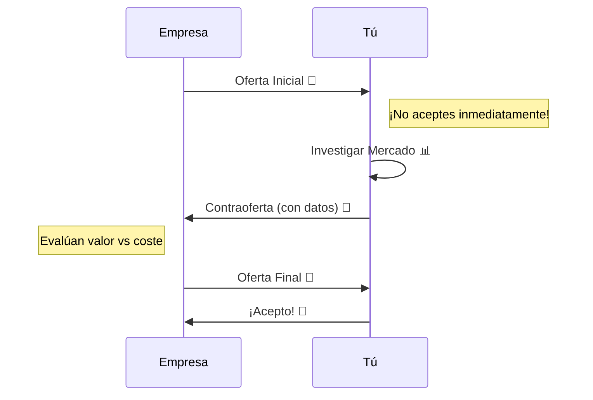

# Cómo Destacar en un Proceso de Selección
## Consejos prácticos para tu carrera


<div class="abs-br m-6 text-xl">
  <a href="https://github.com/Kevincifuentes/VibeCoding" target="_blank" class="slidev-icon-btn">
    <carbon:logo-github />
  </a>
</div>

<!-- Introducción: Vamos a ver cómo destacar en cada fase del proceso de selección, desde el CV hasta la negociación. -->
---
layout: two-cols
transition: fade
---

<div class="abs-tr m-6 text-xl">
  <a href="https://wwww.arangoya.org" target="_blank" class="slidev-icon-btn">
    
  </a>
</div>

# Fase 1: Tu CV es tu Producto 📄

<v-clicks>

<div class="mt-4">

##### 🎯 Personalización
No envíes el mismo PDF a todos. Adapta las palabras clave a la oferta.

##### 🔗 Enlaces que Importan
GitHub (código limpio), LinkedIn (actualizado) y Portafolio (proyectos vivos).

##### 📈 Impacto > Tareas
Las empresas quieren saber qué lograste, no solo qué hiciste.

##### 🕵️ Investigación
Investiga la cultura y salarios reales en **Blind**, **Reddit**, **Glassdoor** y **Levels.fyi** antes de aplicar.

</div>

</v-clicks>

::right::

<div class="ml-6 mt-16">
  <div class="font-bold mb-4 text-gray-400">Ejemplo de Impacto:</div>

  <div class="bg-red-500/10 p-4 rounded-lg mb-4 border-l-4 border-red-500" v-click>
    <div class="text-red-400 font-bold text-sm mb-1">❌ Antes (Genérico)</div>
    <div class="text-sm opacity-80">"Encargado del mantenimiento del servidor y bases de datos."</div>
  </div>

  <div class="bg-green-500/10 p-4 rounded-lg border-l-4 border-green-500" v-click>
    <div class="text-green-400 font-bold text-sm mb-1">✅ Después (Con Impacto)</div>
    <div class="text-sm opacity-80">"Reduje la latencia del servidor en un <b>20%</b> optimizando consultas SQL, mejorando la experiencia de <b>10k+ usuarios</b> diarios."</div>
  </div>
</div>

<div class="abs-br m-6 text-xl">
  <SlideCurrentNo />
</div>

<!-- Fase 1: Fijaos en la diferencia. El 'Antes' dice lo que hicisteis, el 'Después' dice lo que valéis. Usad números. -->
---
layout: two-cols-header
transition: slide-up
---

<div class="abs-tr m-6 text-xl">
  <a href="https://wwww.arangoya.org" target="_blank" class="slidev-icon-btn">
    
  </a>
</div>

# Fase 2: Hackeando el Filtro Inicial 🔍

::left::

<div class="mr-4 mt-4">

<v-clicks>

- **LinkedIn SEO** 💼
  <span class="text-sm opacity-70 block">Los reclutadores buscan por palabras clave. ¡Úsalas!</span>
- **Visibilidad Pública** 🌟
  <span class="text-sm opacity-70 block">Un commit en Open Source vale más que 1000 palabras.</span>
- **El Pitch** 🗣️
  <span class="text-sm opacity-70 block">"Cuéntame sobre ti" no es tu biografía, es tu tráiler.</span>

</v-clicks>

</div>

<br>
<br>
<br>
<br>
<br>
<br>


::right::

<div class="ml-4 mt-4">
  <div class="bg-blue-500/10 p-5 rounded-xl border border-blue-500/20">
    <h3 class="font-bold text-blue-400 mb-3">Fórmula para LinkedIn</h3>
    <div class="space-y-3 text-sm">
      <div class="flex items-center gap-2">
        <span class="bg-blue-500 text-white px-2 rounded text-xs">Rol</span>
        <span>+</span>
        <span class="bg-purple-500 text-white px-2 rounded text-xs">Tech Stack</span>
        <span>+</span>
        <span class="bg-green-500 text-white px-2 rounded text-xs">Valor</span>
      </div>
      <div class="mt-4 bg-black/20 p-3 rounded font-mono text-xs text-green-200">
        "Full Stack Developer | React, Node.js, AWS | Creando soluciones escalables para eCommerce"
      </div>
    </div>

  </div>
</div>

<div class="abs-br m-6 text-xl">
  <SlideCurrentNo />
</div>

<!-- Fase 2: Vuestro titular de LinkedIn es vuestro anuncio de neón. Usad la fórmula: Rol + Tecnología + Valor. -->
---
layout: default
transition: slide-left
---

<div class="abs-tr m-6 text-xl">
  <a href="https://wwww.arangoya.org" target="_blank" class="slidev-icon-btn">
    
  </a>
</div>

# Fase 3: La Prueba Técnica (Live Coding) 💻

<div class="grid grid-cols-[1fr_1.2fr] gap-8 mt-6">

<div>
  <h3 class="font-bold text-orange-400 mb-4">Claves para sobrevivir</h3>
  <v-clicks>
    <div class="mb-4">
      <b>1. No te calles</b> 📢
      <p class="text-sm opacity-70">El silencio es tu enemigo. Explica tu proceso mental.</p>
    </div>
    <div class="mb-4">
      <b>2. Pregunta antes</b> ❓
      <p class="text-sm opacity-70">¿Hay inputs nulos? ¿Qué tan grande es el array?</p>
    </div>
    <div>
      <b>3. Fuerza bruta primero</b> 🔨
      <p class="text-sm opacity-70">Mejor una solución lenta que funciona, que una rápida que no existe.</p>
    </div>
  </v-clicks>
</div>

<div class="text-sm">

```python {all|1-3|5-10}
# ❌ Coding en silencio
def two_sum(nums, target):
    # ...escribe código frenéticamente...
    pass

# ✅ Think Aloud (Pensar en voz alta)
# "Primero, voy a usar un hash map para guardar los complementos."
# "Esto me permite encontrar la pareja en O(n) en vez de O(n^2)."
def two_sum(nums, target):
    seen = {}
    for i, num in enumerate(nums):
        # ...explica mientras escribe...
```

</div>

</div>

<div class="abs-br m-6 text-xl">
  <SlideCurrentNo />
</div>

<!-- Fase 3: En el live coding, vuestra voz es tan importante como vuestro código. Si os atascáis pero explicáis por qué, ganáis puntos. -->
---
layout: full
transition: fade
---

<div class="abs-tr m-6 text-xl">
  <a href="https://wwww.arangoya.org" target="_blank" class="slidev-icon-btn">
    
  </a>
</div>

# Fase 4: La Entrevista con el Equipo 🤝

<div class="grid grid-cols-2 gap-8 mt-12 px-10">

<div class="bg-green-500/5 p-6 rounded-xl border-t-4 border-green-500">
  <h3 class="text-xl font-bold text-green-400 mb-4">✅ PREGUNTA ESTO</h3>
  <ul class="space-y-4">
    <li class="flex items-start gap-3" v-click>
      <span>🚀</span>
      <span>"¿Cuál es el desafío técnico más grande que tenéis ahora?"</span>
    </li>
    <li class="flex items-start gap-3" v-click>
      <span>🐛</span>
      <span>"¿Cómo gestionáis la deuda técnica?"</span>
    </li>
    <li class="flex items-start gap-3" v-click>
      <span>🌱</span>
      <span>"¿Cómo es el proceso de code review y mentoring?"</span>
    </li>
  </ul>
</div>

<div class="bg-red-500/5 p-6 rounded-xl border-t-4 border-red-500">
  <h3 class="text-xl font-bold text-red-400 mb-4">❌ EVITA ESTO</h3>
  <ul class="space-y-4">
    <li class="flex items-start gap-3" v-click>
      <span>🤐</span>
      <span>No tener ninguna pregunta (muestra desinterés).</span>
    </li>
    <li class="flex items-start gap-3" v-click>
      <span>💰</span>
      <span>Preguntar solo por vacaciones/sueldo en la primera técnica.</span>
    </li>
    <li class="flex items-start gap-3" v-click>
      <span>🤷‍♂️</span>
      <span>"Hago lo que me digan" (buscan proactividad).</span>
    </li>
  </ul>
</div>

</div>

<div class="abs-br m-6 text-xl">
  <SlideCurrentNo />
</div>

<!-- Fase 4: Una entrevista es bidireccional. Las preguntas que hacéis dicen mucho de vuestra seniority. -->
---
layout: quote
transition: slide-up
---

<div class="abs-tr m-6 text-xl">
  <a href="https://wwww.arangoya.org" target="_blank" class="slidev-icon-btn">
    
  </a>
</div>

# "Las habilidades técnicas te consiguen la entrevista, pero las habilidades no-técnicas te consiguen el trabajo."

<div class="mt-8 text-xl opacity-80">
  Fase 5: Validación Final
</div>

<div class="mt-4 text-sm opacity-60">
  (Comunicación, Trabajo en Equipo, Resolución de Conflictos)
</div>

<div class="abs-br m-6 text-xl">
  <SlideCurrentNo />
</div>

<!-- Fase 5: No subestiméis el 'Culture Fit'. Si sois unos genios pero nadie quiere trabajar con vosotros, no os contratarán. -->
---
layout: default
transition: fade
---

<div class="abs-tr m-6 text-xl">
  <a href="https://wwww.arangoya.org" target="_blank" class="slidev-icon-btn">
    
  </a>
</div>

# Preguntas Reales de Soft Skills 🗣️

<div class="grid grid-cols-2 gap-6 mt-8">

<div class="bg-red-500/5 p-4 rounded-lg" v-click>
  <div class="font-bold text-red-400 mb-2">🔥 Conflicto</div>
  <div class="text-sm italic">"Cuéntame de una vez que estuviste en desacuerdo con un compañero. ¿Cómo lo resolviste?"</div>
</div>

<div class="bg-orange-500/5 p-4 rounded-lg" v-click>
  <div class="font-bold text-orange-400 mb-2">📉 Fracaso</div>
  <div class="text-sm italic">"Háblame de un error que cometiste recientemente. ¿Cómo lo manejaste?"</div>
</div>

<div class="bg-blue-500/5 p-4 rounded-lg" v-click>
  <div class="font-bold text-blue-400 mb-2">🤝 Trabajo en Equipo</div>
  <div class="text-sm italic">"Describe una situación donde tuviste que explicar algo técnico a alguien que no lo era."</div>
</div>

<div class="bg-green-500/5 p-4 rounded-lg" v-click>
  <div class="font-bold text-green-400 mb-2">🌱 Crecimiento</div>
  <div class="text-sm italic">"¿Cuál consideras que es tu mayor debilidad profesional actual?"</div>
</div>

</div>

<div class="mt-6 text-center text-sm opacity-60">
  💡 Usa el método <b>STAR</b> (Situación, Tarea, Acción, Resultado) para responder.
</div>

<div class="abs-br m-6 text-xl">
  <SlideCurrentNo />
</div>

<!-- Soft Skills Questions: Preparad historias para estas preguntas. El método STAR es vuestro mejor amigo aquí. -->
---
layout: center
transition: slide-left
---

<div class="abs-tr m-6 text-xl">
  <a href="https://wwww.arangoya.org" target="_blank" class="slidev-icon-btn">
    
  </a>
</div>

# Fase 6: El Arte de Negociar 🚀

<div class="mt-8">



</div>

<div class="mt-8 text-center opacity-80">
  Recuerda: El salario es solo una parte. (Remoto, Formación, Equity)
</div>

<div class="abs-br m-6 text-xl">
  <SlideCurrentNo />
</div>

<!-- Fase 6: Negociar es normal. Hacedlo con respeto y datos. Y mirad el paquete completo, no solo el dinero. -->
---
layout: center
transition: fade
---

<div class="abs-tr m-6 text-xl">
  <a href="https://wwww.arangoya.org" target="_blank" class="slidev-icon-btn">
    
  </a>
</div>

# Tu Camino al Éxito Empieza Hoy 🏆

<div class="grid grid-cols-3 gap-6 mt-12 text-center">

<div class="p-4 bg-white/5 rounded-lg" v-click>
  <div class="text-4xl mb-2">📚</div>
  <div class="font-bold">Prepárate</div>
  <div class="text-sm opacity-70">LeetCode, Proyectos, Mock Interviews</div>
</div>

<div class="p-4 bg-white/5 rounded-lg" v-click>
  <div class="text-4xl mb-2">🧠</div>
  <div class="font-bold">Mentalidad</div>
  <div class="text-sm opacity-70">Cada "No" es un aprendizaje</div>
</div>

<div class="p-4 bg-white/5 rounded-lg" v-click>
  <div class="text-4xl mb-2">🚀</div>
  <div class="font-bold">Acción</div>
  <div class="text-sm opacity-70">Aplica, contacta, construye</div>
</div>

</div>

<div class="abs-br m-6 text-xl">
  <SlideCurrentNo />
</div>

<!-- Conclusión: Es una maratón. Preparación, mentalidad y acción. ¡A por ello! -->
