```mermaid {scale: 0.65}
graph TD
    A["Try to fix a small bug 🐛"] --> B["AI suggests a change<br/>that seems reasonable 🤖"]
    B --> C["This creates two more<br/>problems ↗️➡️↘️"]
    C --> D["You ask AI to fix new<br/>issues 👤"]
    D --> B["AI suggests a change<br/>that seems reasonable 🤖"]
```

---
# You can also start simply with 'default'
theme: seriph
# random image from a curated Unsplash collection by Anthony
# like them? see https://unsplash.com/collections/94734566/slidev
background: /centro_arangoya.jpg
# some information about your slides (markdown enabled)
author: Kevin Cifuentes
title: Vibe Coding
info: |
  ## Vibe Coding
  The 70% problem
# apply unocss classes to the current slide
class: text-center
favicon: /favicon.png
# https://sli.dev/features/drawing
drawings:
  persist: false
# slide transition: https://sli.dev/guide/animations.html#slide-transitions
transition: slide-left
# enable MDC Syntax: https://sli.dev/features/mdc
mdc: true
lineNumbers: true
# open graph
# seoMeta:
#  ogImage: https://cover.sli.dev
---

# Vibe Coding

The 70% problem 

  <a href="https://github.com/Kevincifuentes/VibeCoding" target="_blank" class="slidev-icon-btn">
    <carbon:logo-github />
  </a>

<!--
Portada: título y visual de Vibe Coding. Introduce el “70% problem” y enlaza al repositorio de ejemplo.
-->

---
transition: fade-out
layout: center
---

  

# The 70% percent (and then rest 30%) problem 

  <Tweet id='1863058206752379255' scale="0.8" hideCard={false} hideThread={false} />

  <SlideCurrentNo />

<!-- 

La IA ha hecho que el problem inicial del 100% (el humano tiene que hacer todo el trabajo, programarlo y completarlo) se convierta en un problema de 70-30, es decir, la IA es capaz de completar el 70% del trabajo, pero carece de una serie de aspectos para cubrir el 30%:

- Desconoce la complejidad asociada a sus cambios (a qué otros sistemas puede afectar, por ejemplo)
- Carece del conocimiento de negocio para entender si su cambio encaja con los flujos de la empresa (salvo que se lo demos por adelantado)
- Desconoce los "corner cases", la arquitectura que se utiliza o asegura mantenibilidad.

Hay que tener claro que la IA no entiende realmente el problema, solamente es capaz de buscar patrones comunes ya probados (en Internet, conocidos) y hacer un remix de los mismos buscando conexiones. 

Es por eso, que en realidad, viene a reemplazar el proceso más automatizado y repetitivo, pero el 30% sigue siendo trabajo humano.

-->

---
transition: slide-up
layout: section
---

  

# AI is a powerful tool, but it's not a magic bullet. <b> Human judgment and good software engineering practises</b> are essential

  <SlideCurrentNo />

<!-- 

De manera general, la IA es una herramienta super valiosa, pero sigue requiriendo una intervención humana, la cuál es vital para que todo sistema sea realmente éxitoso.

Nos tenemos que centrar en ese 30%.

-->

---
transition: fade
---

  

  <SlideCurrentNo />

# How developers use AI: two patterns

  

    <h2>Bootstrappers</h2>
     
    

      
    

    

      
    

    

      
    

  

  

    <h2>Iterators</h2>
     
    

      
    

    

      
    

    

      
    

  

  What is the take?

<!--
 Hay dos tipos de maneras en cómo los desarrolladores utilizan la IA:
 * Iniciadores: crean desde 0 un sistema con un diseño o concepto prestablecido, generalmente usando herramientas no-code o screenshot-to-code (Bolt, V0, etc)
 * Iteradores: usan herramientas con IA en su trabajo diario, potenciando su eficiencia (Cursor, Github Copilot, Cursor, etc). Recomendaciones, refactoring, generando tests (usando la IA como un "pair programmer")

Entre estos dos modelos hay una diferencia crucial: los iniciadores, generalmente, no tienen los suficientes conocimientos para diferenciar si lo generado por la IA está bien o no, pero los iteradores en cambio, revisan, corrigen y mejoran lo que la IA les presenta, aplicando años de experiencia y aumentando la potencia de la IA.

-->

---
transition: fade
layout: section
---

  

# Enhancing that 70%: Common Junior <b>failure patterns</b>

  <SlideCurrentNo />

<!--
 A continuación vamos a ver una serie de patrones asociados a trabajar con la IA y que realmente son errores, lo que hace el proceso se eternice y se pierda la mejora de eficiencia. ¿Cómo usáis vosotros la IA?
-->

---
transition: fade
layout: full
---

  

# Common failure patterns: <b>Two steps back problem</b>

  <SlideCurrentNo />

<!--

Este patrón es común especialmente en personas que utilizan la IA para crear algo pero no tienen el conocimiento suficiente para entender lo que están creando. También llamado Whack-a-mole. Se acepta una solución y esta solución genera n problemas y, por tanto, n soluciones nuevas que potencialmente generarán n problemas más.

Es la diferencia entre un programador Junior y uno Senior, la "paradoja del conocimiento". Mientras que un desarrollador Senior utiliza la IA para acelerar su proceso de un conocimiento/experiencia que ya posee, el junior la utiliza para aprender qué hacer. Por eso, es importante que no solamente useis la IA para que "os haga el trabajo" si no que os ayudéis de la IA para entender el "por qué se hace así el trabajo".

-->

---
transition: fade
layout: full
---

  

# Common failure patterns: <b>Demo-quality trap</b>

  

  <SlideCurrentNo />

<!--

Es un patrón cada vez más común, debido a la necesidad de presentar prototipos (MVP, Minimum Viable Product) con mayor velocidad. En esencia, hace referencia al hecho de que estos prototipos generados puede que cubran el Happy Path, es decir, el flujo normal éxitoso que hará el usuario, pero cuando empeizas a indagar y te encuentras con corner cases (casos no tan comunes) el prototipo empieza hacer aguas. Precisamente esto es la diferencia entre software que alguien ama (pongamos Google, Apple, etc) de ejemplo y software que simplemente "tolera". 

Puntos como Seguridad, rendimiento, accesibilidad son parte de los detalles y vienen de la experiencia y la empatía.

-->

---
transition: slide-up
layout: full
---
# Patterns that actually work!

  

    
<h2 class="m-0">AI as first drafter</h2>

    

AI is going to do the <b>whole implementation</b> so if you are using on a team, communication is key to avoid duplications. It's important to stablish <b>code standards and conventions</b> (for example, rules in Cursor or README.md) to follow same exact practises. Really important tool like <b>GIT</b> to mantain different versions.

  

  

    
<h2 class="m-0">AI as pair programmer</h2>

    

Hybrid: Human-AI interaction by implementation and review of code generated. Gives <b>best of both worlds</b>, giving also the opportunity to improve and learn to the human being.

  

  

    
<h2 class="m-0">AI as validator</h2>

    

<b>Human still does the implementation</b> but <b>AI reviews </b> it and gives suggestions or changes to the implemented code to avoid bugs or enhance the current

  

<!--
Los patrones que sí funcionan y hay que seguir son los siguientes:
* Usar la IA con un primer paso para empezar un proyecto y utilizarla frecuentemente para seguir incrementandolo. Es importante establecer una reglas a la IA para sean comunes en todo el equipo y que la IA genere lo mismo para todos (Cursor Rules). Importante Git, siempre.
* Usar la IA como pair programmer, pidiendole cosas y revisando lo que genera para modificarlo o pedirle cambios a lo mismo. Permite crecer como profesional sin perder el conocimiento de programación.
* Usar la IA como validación, es decir, seguimos programando los humanos pero con supervisión/mejoras de lo programado por parte de la IA.

-->

---
layout: two-cols-header
transition: fade
class: text-left
---

  

  <SlideCurrentNo />

# Team Coordination Essentials
:: left ::

## Preventing Chaos:

- Coordination prevents <b>duplication</b>: both ask the AI to create a formatDate helper, you might end up with two similar functions

- Teams that successfully integrate AI tools often start by agreeing on <b>coding standards and prompting practices</b>

- Share and reuse <b>effective prompts</b>

 
 
 
 

:: right ::

<iframe src="https://www.redditmedia.com/r/vibecoding/comments/1myakhd/how_we_vibe_code_at_a_faang/?embed=true&ref_source=embed&ref=share" sandbox="allow-scripts allow-same-origin allow-popups" style="border: none; width:100%; height:400px; border-radius: 8px;" scrolling="yes" loading="lazy"></iframe>

<!--

Coordinación antes de generar código:
- Acordad estándares de código y prácticas de prompting para todo el equipo.
- Compartid y reutilizad prompts eficaces (evita “reinventar” funciones).
- Ejemplo: si dos personas piden a la IA un helper `formatDate`, sin coordinación aparecerán dos variantes casi iguales.

Idea clave: menos sorpresas y menos duplicaciones cuando hay acuerdos previos.
-->

---
transition: slide-left
layout: image-left
image: /versions.jpg
---

  

  <SlideCurrentNo />

# Version Control Best Practices: Why so important?

- <b>Commits</b> act as the safety net to catch AI missteps; if an AI-generated change breaks something, you can <b>revert</b> to a previous commit

- Frequent commits ensure that if you need to bisect issues or undo a portion of AI-introduced code, the <b>history</b> is granular enough

- <b>Descriptive commit messages</b> are important; some teams even tag commits that had heavy AI involvement, just for <b>traceability</b>

<!--

Por qué Git es crítico con IA:
- Los commits actúan como red de seguridad: si una sugerencia rompe algo, revertimos.
- Commits pequeños y frecuentes facilitan bisectar y aislar cambios generados por IA.
- Mensajes descriptivos y etiquetas para trazabilidad (saber qué tuvo participación de la IA).

Consejo: separa el trabajo humano del de la IA en commits distintos.
-->

---
transition: slide-up
layout: full
---

  

  <SlideCurrentNo />

# The Golden Rules of Vibe Coding 🥇

### Essential Principles:

- Be specific and clear about <b>what you want</b>

- <b>Always validate</b> AI output against your intent, don't merge code you don't understand

- Treat AI as a junior developer (with supervision)

- <b>Use AI to expand your capabilities</b>, not replace your thinking

- Ensure that all code, whether human or AI-written, undergoes <b>code review</b>

<!--

Reglas prácticas al trabajar con IA:
- Sé específico con lo que pides; define el resultado esperado.
- Valida siempre contra tu intención; no fusiones código que no entiendas.
- Trata a la IA como a un junior: guía, supervisa y corrige.
- Usa la IA para ampliar capacidades, no para apagar el pensamiento crítico.
- Todo el código debe pasar revisión, sea humano o generado por IA.

Objetivo: velocidad sin perder calidad ni comprensión.
-->
---
transition: fade
---

  

  <SlideCurrentNo />

# Senior vs Junior Developer Dynamics

### <b>Experience</b> Makes the Difference:

  

    <h2>Senior Engineers 👴🏻:</h2>
     
    <ul>
      <li>They're not just accepting what the AI suggests. They're constantly <b>refactoring</b></li>
      <li>They're applying years of <b>hard-won engineering wisdom</b> to shape and constrain the AI's output"</li>
      <li>The <b>AI is accelerating their implementation</b>, but their expertise is what keeps the code maintainable</li>
    </ul>
  

  

    <h2>Junior Engineers 👶:</h2>
     
    <ul>
      <li>Often <b>accept the AI's output</b> more readily</li>
      <li>Need to learn: <b>Don't skip the 'Why'</b> - understand underlying concepts</li>
    </ul>
  

<!--

Senior vs Junior:
- Senior: refactoriza de continuo, aplica criterio y contexto; usa la IA para acelerar decisiones que ya entiende.
- Junior: tiende a aceptar la salida de la IA; necesita profundizar en el “por qué” detrás de cada solución.

Mensaje: la experiencia guía a la IA, no al revés.
-->

---
transition: fade-out
layout: center
---

  

  <SlideCurrentNo />

# Key Takeaways

### The Bottom Line:

- 🤖🧠🛠️ AI is a powerful tool, but <b>it's not a magic bullet...</b> human judgment and good software engineering practices are still essential
- ✨ The craft of software engineering is more than writing <b>code that works</b>. It's about writing code that <b>works well</b>
- ⚖️ Success requires <b>balancing AI acceleration with human expertise</b>
- 🎯 Focus on developing the <b>durable 30% skills</b> that AI cannot replicate
- 🔄 Software engineering is more than writing code, after all - <b>it's a whole workflow</b>

<!--

Cierre:
- La IA acelera, pero el valor humano está en el criterio, la calidad y el diseño del sistema.
- Equilibrar aceleración con expertise.
- Enfocar en las habilidades del 30% que no se automatizan.

Takeaway: ingeniería de software = flujo completo, no solo código.
-->
---
layout: center
transition: fade
---

  

# Bibliography 📚
Useful resources

Beyond Vibe Coding (Addy Osmani) — [O'Reilly Media](https://www.oreilly.com/library/view/beyond-vibe-coding/9798341634749/)

<!--

Más para explorar:
- Addy Osmani, “Beyond Vibe Coding”.
- Útil para profundizar en prácticas.
-->

  <SlideCurrentNo />

