```mermaid {scale: 0.65}
graph TD
    A["Try to fix a small bug 🐛"] --> B["AI suggests a change<br/>that seems reasonable 🤖"]
    B --> C["This creates two more<br/>problems ↗️➡️↘️"]
    C --> D["You ask AI to fix new<br/>issues 👤"]
    D --> B["AI suggests a change<br/>that seems reasonable 🤖"]
```

---
# You can also start simply with 'default'
theme: seriph
# random image from a curated Unsplash collection by Anthony
# like them? see https://unsplash.com/collections/94734566/slidev
background: /centro_arangoya.jpg
# some information about your slides (markdown enabled)
author: Kevin Cifuentes
title: Vibe Coding
info: |
  ## Vibe Coding
  The 70% problem
# apply unocss classes to the current slide
class: text-center
favicon: /favicon.png
# https://sli.dev/features/drawing
drawings:
  persist: false
# slide transition: https://sli.dev/guide/animations.html#slide-transitions
transition: slide-left
# enable MDC Syntax: https://sli.dev/features/mdc
mdc: true
lineNumbers: true
# open graph
# seoMeta:
#  ogImage: https://cover.sli.dev
---

# Vibe Coding

The 70% problem 

  <a href="https://github.com/Kevincifuentes/VibeCoding" target="_blank" class="slidev-icon-btn">
    <carbon:logo-github />
  </a>

---
transition: fade-out
layout: center
---

  

# The 70% percent (and then rest 30%) problem 

  <Tweet id='1863058206752379255' scale="0.8" hideCard={false} hideThread={false} />

  <SlideCurrentNo />

<!-- 

La IA ha hecho que el problem inicial del 100% (el humano tiene que hacer todo el trabajo, programarlo y completarlo) se convierta en un problema de 70-30, es decir, la IA es capaz de completar el 70% del trabajo, pero carece de una serie de aspectos para cubrir el 30%:

- Desconoce la complejidad asociada a sus cambios (a qué otros sistemas puede afectar, por ejemplo)
- Carece del conocimiento de negocio para entender si su cambio encaja con los flujos de la empresa (salvo que se lo demos por adelantado)
- Desconoce los "corner cases", la arquitectura que se utiliza o asegura mantenibilidad.

Hay que tener claro que la IA no entiende realmente el problema, solamente es capaz de buscar patrones comunes ya probados (en Internet, conocidos) y hacer un remix de los mismos buscando conexiones. 

Es por eso, que en realidad, viene a reemplazar el proceso más automatizado y repetitivo, pero el 30% sigue siendo trabajo humano.

-->

---
transition: slide-up
layout: section
---

  

# AI is a powerful tool, but it's not a magic bullet. <b> Human judgment and good software engineering practises</b> are essential

  <SlideCurrentNo />

<!-- 

De manera general, la IA es una herramienta super valiosa, pero sigue requiriendo una intervención humana, la cuál es vital para que todo sistema sea realmente éxitoso.

Nos tenemos que centrar en ese 30%.

-->

---
transition: fade
---

  

  <SlideCurrentNo />

# How developers use AI: two patterns

  

    <h2>Bootstrappers</h2>
     
    

      
    

    

      
    

    

      
    

  

  

    <h2>Iterators</h2>
     
    

      
    

    

      
    

    

      
    

  

  What is the take?

<!--
 Hay dos tipos de maneras en cómo los desarrolladores utilizan la IA:
 * Iniciadores: crean desde 0 un sistema con un diseño o concepto prestablecido, generalmente usando herramientas no-code o screenshot-to-code (Bolt, V0, etc)
 * Iteradores: usan herramientas con IA en su trabajo diario, potenciando su eficiencia (Cursor, Github Copilot, Cursor, etc). Recomendaciones, refactoring, generando tests (usando la IA como un "pair programmer")

Entre estos dos modelos hay una diferencia crucial: los iniciadores, generalmente, no tienen los suficientes conocimientos para diferenciar si lo generado por la IA está bien o no, pero los iteradores en cambio, revisan, corrigen y mejoran lo que la IA les presenta, aplicando años de experiencia y aumentando la potencia de la IA.

-->

---
transition: fade
layout: section
---

  

# Enhancing that 70%: Common Junior <b>failure patterns</b>

  <SlideCurrentNo />

<!--
 A continuación vamos a ver una serie de patrones asociados a trabajar con la IA y que realmente son errores, lo que hace el proceso se eternice y se pierda la mejora de eficiencia. ¿Cómo usáis vosotros la IA?
-->

---
transition: fade
layout: full
---

  

# Common failure patterns: <b>Two steps back problem</b>

  <SlideCurrentNo />

<!--

Este patrón es común especialmente en personas que utilizan la IA para crear algo pero no tienen el conocimiento suficiente para entender lo que están creando. También llamado Whack-a-mole. Se acepta una solución y esta solución genera n problemas y, por tanto, n soluciones nuevas que potencialmente generarán n problemas más.

Es la diferencia entre un programador Junior y uno Senior, la "paradoja del conocimiento". Mientras que un desarrollador Senior utiliza la IA para acelerar su proceso de un conocimiento/experiencia que ya posee, el junior la utiliza para aprender qué hacer. Por eso, es importante que no solamente useis la IA para que "os haga el trabajo" si no que os ayudéis de la IA para entender el "por qué se hace así el trabajo".

-->

---
transition: fade
layout: full
---

  

# Common failure patterns: <b>Demo-quality trap</b>

  

  <SlideCurrentNo />

<!--

Es un patrón cada vez más común, debido a la necesidad de presentar prototipos (MVP, Minimum Viable Product) con mayor velocidad. En esencia, hace referencia al hecho de que estos prototipos generados puede que cubran el Happy Path, es decir, el flujo normal éxitoso que hará el usuario, pero cuando empeizas a indagar y te encuentras con corner cases (casos no tan comunes) el prototipo empieza hacer aguas. Precisamente esto es la diferencia entre software que alguien ama (pongamos Google, Apple, etc) de ejemplo y software que simplemente "tolera". 

Puntos como Seguridad, rendimiento, accesibilidad son parte de los detalles y vienen de la experiencia y la empatía.

-->

