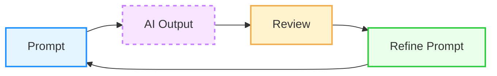

---
# You can also start simply with 'default'
theme: seriph
# background image
background: /centro_arangoya.jpg
# slide metadata
author: Kevin Cifuentes
title: The Art of the Prompt
info: |
  ## The Art of the Prompt 
  Communicating effectively with AI through prompt engineering.
# apply unocss classes to the current slide
class: text-center
favicon: /favicon.png
# drawings config
drawings:
  persist: false
# slide transition: https://sli.dev/guide/animations.html\#slide-transitions
transition: slide-left
# enable MDC Syntax: https://sli.dev/features/mdc
mdc: true
lineNumbers: true
---

# The Art of the Prompt 

## Communicating effectively with AI


<div class="abs-br m-6 text-xl">
  <a href="https://github.com/Kevincifuentes/VibeCoding" target="_blank" class="slidev-icon-btn">
    <carbon:logo-github />
  </a>
</div>

---
layout: cover
---

<div class="abs-tr m-6 text-xl">
  <a href="https://wwww.arangoya.org" target="_blank" class="slidev-icon-btn">
    
  </a>
</div>

# The New <b>Source Code</b> 💻

<div class="text-center mt-8">

**"In vibe coding, prompts are the new source code"**

</div>

Prompt engineering is the <b>skill of speaking the AI's language</b> 🗣️

<b>Well-crafted prompts</b> = perfect solutions vs irrelevant/buggy suggestions

<b>Programming through AI</b> using natural language 🚀

<div class="abs-br m-6 text-xl">
  <SlideCurrentNo />
</div>

---
layout: default
transition: fade
---

<div class="abs-tr m-6 text-xl">
  <a href="https://wwww.arangoya.org" target="_blank" class="slidev-icon-btn">
    
  </a>
</div>

# Why Prompts Matter: Core principles 🎯

- **LLMs are not mind readers** 🧠 - they respond only to the input given
- **Think like a spec writer** 📝 - write prompts like documentation for a literal, pedantic junior developer
- **Reproducibility** 🔄 - effective prompts become valuable knowledge assets
- **Future-proofing** 🔮 - prompt skills help harness new AI capabilities


<div class="abs-br m-6 text-xl">
  <SlideCurrentNo />
</div>

---
layout: default
transition: fade
---

<div class="abs-tr m-6 text-xl">
  <a href="https://wwww.arangoya.org" target="_blank" class="slidev-icon-btn">
    
  </a>
</div>

# The Golden Rule: Specificity and Clarity ⚡

**Essential Elements to Include:**

- **Programming language and framework** 🐍 ("Write a Python function..." vs "Write a function...")
- **Exact error messages** 🚨 and describe what the code should do
- **Input/output structure** 📊 and expected behavior
- **Requirements and constraints** ⚙️ (performance, algorithms, libraries)
- **Scope definition** 🎯 (single function vs complete module vs tests included)
- **Output format** 📋 (code only, code with comments, explanations)

<div class="abs-br m-6 text-xl">
  <SlideCurrentNo />
</div>

---
layout: full
transition: slide-up
---

<div class="abs-tr m-6 text-xl">
  <a href="https://wwww.arangoya.org" target="_blank" class="slidev-icon-btn">
    
  </a>
</div>

# The Iterative Refinement Loop 🔄


<div class="flex justify-center items-center">



</div>

**Best Practices:**
- Review AI code as critically as human-written code 👀
- Provide specific feedback, not just "that's wrong" 💬
- Keep iteration changes small to preserve good parts 🔧
- Use "rubber duck" debugging 🦆: ask AI to walk through code step-by-step

<div class="abs-br m-6 text-xl">
  <SlideCurrentNo />
</div>

---
layout: two-cols-header
transition: slide-left
---

<div class="abs-tr m-6 text-xl">
  <a href="https://wwww.arangoya.org" target="_blank" class="slidev-icon-btn">
    
  </a>
</div>

# Core Prompting Techniques (Part 1) 🛠️

::left::

## Basic Techniques

<div class="text-sm">

**Zero-Shot** 🎯
- Direct instruction without examples
- *When to use*: Standard, clear tasks

**Few-Shot** 📚
- Provide 1-5 examples of desired input/output
- *When to use*: Specific formats, unusual tasks, style consistency

**Chain-of-Thought (CoT)** 🧠
- "Let's think step-by-step"
- <b>Crucial for students/junior developers</b>
- *When to use*: Complex reasoning, debugging, explanations needed

</div>

::right::
  


<div class="abs-br m-6 text-xl">
  <SlideCurrentNo />
</div>

---
layout: two-cols-header
transition: fade
---

<div class="abs-tr m-6 text-xl">
  <a href="https://wwww.arangoya.org" target="_blank" class="slidev-icon-btn">
    
  </a>
</div>

# Core Prompting Techniques (Part 2) 🚀

::left::

## Advanced Techniques

<div class="text-sm">

**Role Prompting** 🎭
- "You are an expert Python developer..."
- *When to use*: Influence style, depth, and perspective

**Contextual Prompting** 📋
- Provide relevant data, API specs, class definitions
- *When to use*: Integration with existing code, specific requirements

**Metaprompting** 🎨
- Instructions about output format
- *When to use*: Precise formatting needs, automated processing

</div>

::right::
  


<div class="abs-br m-6 text-xl">
  <SlideCurrentNo />
</div>

---
layout: two-cols-header
transition: slide-up
---

<div class="abs-tr m-6 text-xl">
  <a href="https://wwww.arangoya.org" target="_blank" class="slidev-icon-btn">
    
  </a>
</div>

# Comparing Prompt Quality ⚖️

::left::


<div class="pr-6 max-w-[44rem]">

## Poor Prompt Example ❌

```javascript
"Why isn't my mapUsersById function working?"
```

**Result**: Generic debugging advice, no actual solution

</div>

<br>
<br>
<br>

<br>
<br>
<br>
<br>
<br>
::right::


<div class="pl-6 max-w-[30rem]">

## Improved Prompt Example ✅

```javascript
"I have a JavaScript function mapUsersById that 
converts an array of user objects into a map 
keyed by user ID. It throws 'Cannot read property 
id of undefined' when I pass [{id: 1, name: "Alice"}]. 
Here's the code: [code snippet]. What is the bug and 
how can I fix it?"
```

**Result**: Precise identification of the loop bounds bug and exact fix

</div>


<div class="abs-br m-6 text-xl">
  <SlideCurrentNo />
</div>

---
layout: default
transition: fade
---

<div class="abs-tr m-6 text-xl">
  <a href="https://wwww.arangoya.org" target="_blank" class="slidev-icon-btn">
    
  </a>
</div>

# Advanced Strategies 🎯
##

**Combining Techniques:** 🔗
- Mix role + CoT: "As a senior engineer, think step-by-step..."
- Few-shot + constraints: Examples with specific requirements
- Context + metaprompting: Background info with format instructions

**Complex Task Management:** 📋
- Break large tasks into subtasks
- Use separate prompts for <b>planning</b> vs <b>implementation</b>
- Leverage stateful conversations for <b>iterative development</b>

<div class="abs-br m-6 text-xl">
  <SlideCurrentNo />
</div>

---
layout: full
transition: slide-up
---

<div class="abs-tr m-6 text-xl">
  <a href="https://wwww.arangoya.org" target="_blank" class="slidev-icon-btn">
    
  </a>
</div>

# Common Antipatterns to Avoid ⚠️

<div class="text-sm">

| **Antipattern** | **Problem** | **Solution** |
|-----------------|-------------|--------------|
| **Vague Prompt** | "It doesn't work, fix it" | Add context, error messages, specifics |
| **Overloaded** | Too many tasks at once | Split into sequential prompts |
| **Missing Question** | Code dump without clear ask | Always include explicit instruction |
| **Vague Criteria** | "Make it faster/cleaner" | Define specific success metrics |
| **Ignoring Clarifications** | Not answering AI's questions | Respond to clarification requests |
| **Inconsistent Style** | Mixed formats/approaches | Maintain consistent prompt structure |

</div>

<div class="abs-br m-6 text-xl">
  <SlideCurrentNo />
</div>

---
layout: two-cols-header
transition: fade
---

<div class="abs-tr m-6 text-xl">
  <a href="https://wwww.arangoya.org" target="_blank" class="slidev-icon-btn">
    
  </a>
</div>

# Practical Guidelines 📖


::left::

## Do's ✅

- Start with zero-shot, then refine if needed
- Provide examples for specific formats
- Use step-by-step for complex logic
- Set roles for appropriate complexity level
- Include relevant context and constraints

<br>
<br>
<br>
<br>
<br>

::right::

## Don'ts ❌

- Write novel-length prompts with irrelevant info
- Assume AI will correctly fill in missing details
- Use open-ended creative prompts for deterministic outputs
- Reference "above code" without clear context

<div class="abs-br m-6 text-xl">
  <SlideCurrentNo />
</div>

---
layout: two-cols-header
transition: fade
---

<div class="abs-tr m-6 text-xl">
  <a href="https://wwww.arangoya.org" target="_blank" class="slidev-icon-btn">
    
  </a>
</div>

# Key Takeaways 🎯

<!-- Aquí están los puntos clave que queremos que se lleven de esta charla -->
<!-- Básicamente, esto es lo que esperamos que recuerden después de todo -->

::right::

1. **Treat prompting as a new essential programming skill** 💻
<!-- Esto es súper importante - ya no es solo saber programar, ahora hay que saber hablar con la IA -->
2. **Communication quality directly impacts code quality** 📢
<!-- Si no sabes explicar bien lo que quieres, la IA no va a entender y te va a dar código malo -->
3. **Iteration and refinement are normal and expected** 🔄
4. **Combine techniques for complex scenarios** 🧩
5. **Learn from failures - refine prompts like debugging code** 🐛

::left::


<div class="text-center mt-8 text-lg">

**Remember**: Prompt engineering is both an art and a science - practice makes perfect! 🎨🔬

</div>

<div class="abs-br m-6 text-xl">
  <SlideCurrentNo />
</div>

---
layout: center
transition: fade
---

<div class="abs-tr m-6 text-xl">
  <a href="https://wwww.arangoya.org" target="_blank" class="slidev-icon-btn">
    
  </a>
</div>

# Bibliography 📚
Useful resources

Beyond Vibe Coding (Addy Osmani) — [O'Reilly Media](https://www.oreilly.com/library/view/beyond-vibe-coding/9798341634749/)

Prompt Engineering Guide — [promptingguide.ai](https://www.promptingguide.ai/)

OpenAI Prompt Engineering — [platform.openai.com](https://platform.openai.com/docs/guides/prompt-engineering)

<div class="abs-br m-6 text-xl">
  <SlideCurrentNo />
</div>
