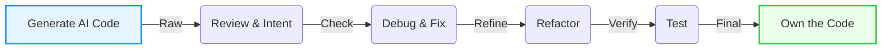

# Understanding Generated Code

## Review, Refine, Own

  <a href="https://github.com/Kevincifuentes/VibeCoding" target="_blank" class="slidev-icon-btn">
    <carbon:logo-github />
  </a>

<!-- Chapter 5: Understanding Generated Code—Review, Refine, Own -->
---
layout: center
transition: fade
---

  

# The Critical Phase After Generation 🛑
## From AI Output to Production-Ready Code

  
👀

  <h3 class="font-bold">Review</h3>
  
Correctness & Intent

  
🧪

  <h3 class="font-bold">Test</h3>
  
Thoroughly

  
🤝

  <h3 class="font-bold">Own</h3>
  
As your project

"You cannot just take the AI's output and ship it."

  <SlideCurrentNo />

<!-- Slide 1: The Critical Phase After Generation -->
---
layout: default
transition: slide-up
---

  

# From Intent to Implementation 🔍
## Step 1: Understanding the AI's Interpretation

<v-clicks>

- **Requirements Check** 📋
  Does it fulfill the prompt?
- **Trace Execution** 🧠
  Read through logic carefully
- **Multi-part Verification** 🔗
  Did it do X *and* Y?

</v-clicks>

<v-clicks>

- **Check for Extras** 🎁
  Unasked logging or features?
- **Edge Cases** ⚠️
  Empty inputs, nulls, negatives?
- **Ambiguities** ❓
  Where did it guess?

</v-clicks>

  <b>Key Point:</b> Understanding code by reading is faster than debugging later.

  <SlideCurrentNo />

<!-- Slide 2: From Intent to Implementation -->
---
transition: fade
---

  

# The Majority Solution Problem 📉

  <h3 class="text-xl font-bold text-red-400 mb-3">The Trap</h3>
  

    AI models output the <b>most common</b> solution, not necessarily the best.
  

  

    <b>Example:</b> 
    Asked for "search" → AI gives <code>Linear Search</code> (O(n)) 
    You needed <code>Binary Search</code> (O(log n))
  

  <h3 class="text-xl font-bold text-green-400">How to Address It</h3>
  
  

    
🧐

    

      
Identify Assumptions

      
Is the input sorted? Valid?

    

  

  

    
🔄

    

      
Consider Alternatives

      
Is this the best algorithm?

    

  

  

    
🧱

    

      
Check Edge Conditions

      
Boundaries, nulls, empty?

    

  

  "AI gives an educated guess; you provide the context."

  <SlideCurrentNo />

<!-- Slide 3: The Majority Solution Problem -->
---
layout: two-cols-header
transition: slide-left
---

  

# Code Readability and Structure 📝

::left::

<h3 class="font-bold mb-4 text-orange-400">Patterns to Watch For</h3>

  

    
💬 Excessive Comments

    
Learned from tutorials

  

  

    
🏷️ Generic Names

    
<code>data</code>, <code>item</code>, <code>val</code>

  

  

    
📜 Verbose Style

    
Overly explicit logic

  

 
 
 
 
 

::right::

<h3 class="font-bold mb-4 text-blue-400">Readability Checklist</h3>

<ul class="space-y-2 text-sm">
  <li class="flex items-center gap-2" v-click>
    ✔ <b>Rename variables</b>
  </li>
  <li class="flex items-center gap-2" v-click>
    ✔ <b>Prune comments</b>
  </li>
  <li class="flex items-center gap-2" v-click>
    ✔ <b>Apply formatting</b> (Black/Prettier)
  </li>
  <li class="flex items-center gap-2" v-click>
    ✔ <b>Simplify structure</b>
  </li>
  <li class="flex items-center gap-2" v-click>
    ✔ <b>Check team style</b>
  </li>
</ul>

  <SlideCurrentNo />

<!-- Slide 4: Code Readability and Structure -->
---
layout: full
transition: fade
---

  

# Red Flags in AI-Generated Code 🚩

 
 
 

  
Off-by-one

  
Loop boundaries (< vs <=)

  
Exceptions

  
Unhandled file/format errors

  
Performance

  
Inner loops, O(n^2) ops

  
Libraries

  
Unintended/outdated deps

  
Inconsistencies

  
Docstrings ≠ Code logic

  
Placeholders

  
"Your code here" left in

"Syntax issues are rare, but logic gaps are common."

  <SlideCurrentNo />

<!-- Slide 5: Red Flags in AI-Generated Code -->
---
layout: quote
transition: slide-up
---

  

# The Code Review Mindset 🧠

"Treat AI Code Like an Intern's Work"

Review it for quality and correctness as you would any colleague's code.

Don't assume it's correct just because it "looks polished".

Manual trace through logic with sample inputs.

Mentally test edge cases.

Ask "why" about unclear patterns.

**Remember: This is your code now. You're responsible for it.**

  <SlideCurrentNo />

<!-- Slide 6: The Code Review Mindset -->
---
layout: default
transition: fade
---

  

# Debugging AI-Generated Code 🐞
 

## Six-Step Debugging Approach
 

  

    
1

    <b>Reproduce</b> with failing inputs
  

  

    
2

    <b>Locate</b> source (print/debug)
  

  

    
3

    <b>Check Prompt</b> vs Code
  

  

    
4

    <b>Leverage AI</b> ("Fix this error...")
  

  

    
5

    <b>Fix</b> (Manual or AI)
  

  

    
6

    <b>Test Again</b> (Regression check)
  

  💡
  <b>Pro Tip:</b> Write a few tests for critical functions. 
  Test-driven debugging is faster than manual checking.

  <SlideCurrentNo />

<!-- Slide 7: Debugging AI-Generated Code -->
---
layout: full
transition: slide-left
---

  

# Understanding Why Bugs Occur 🤔

  <h3 class="text-2xl font-bold mb-4 text-red-400">The "Why" Question</h3>
  
When you find a bug, don't just fix it.

  

    Did the prompt lack clarity? 
    Did I miss an edge case?
  

  
This informs future prompting.

  <h3 class="text-2xl font-bold text-blue-400" v-click>Example Scenario</h3>
  
  

    
Issue

    
AI ignores empty inputs.

  

  
⬇️

  

    
Workflow Fix

    
Always specify "handle empty inputs" in prompts.

  

  <SlideCurrentNo />

<!-- Slide 8: Understanding Why Bugs Occur -->
---
layout: default
transition: fade
---

  

# Refactoring for Maintainability 🛠️

  
🎨

  <h3 class="font-bold">Style</h3>
  
Align with guidelines (Black, gofmt)

  
🏷️

  <h3 class="font-bold">Naming</h3>
  
No more <code>helper1</code>

  
✂️

  <h3 class="font-bold">Prune</h3>
  
Remove unused blocks

  
📄

  <h3 class="font-bold">Docs</h3>
  
Standard docstrings

  
⚡

  <h3 class="font-bold">Optimize</h3>
  
Check complexity

  
✨

  <h3 class="font-bold">Simplify</h3>
  
Reduce verbosity

  "Make it look like good code, not AI code."

  <SlideCurrentNo />

<!-- Slide 9: Refactoring for Maintainability -->
---
layout: two-cols-header
transition: slide-up
---

  

# Testing is Non-Negotiable 🧪

  
Unit Tests

  
Test individual functions and edge cases.

  

    Example: Primes (0, 1, -1, large)
  

  
Integration

  
Interactions with DBs, APIs, and other modules.

  
End-to-End

  
Full workflow from start to finish.

  "Even simple asserts are better than nothing."

  <SlideCurrentNo />

<!-- Slide 10: Testing is Non-Negotiable -->
---
layout: center
transition: fade
---

  

# What Testing Provides 🛡️
## Beyond Finding Bugs

- **Locks down behavior** — If you change something later or AI does, tests guard functionality
- **Asserts ownership** — Once tested and fixed, it's fair to say the code is yours
- **Builds confidence** — You understand it, trust it, and have tests to guard it
- **Creates regression detection** — Future changes won't silently break functionality

> **Important Note**: AI tools may suggest tests (e.g., CodeWhisperer with assert suggestions), but don't assume they're 100% comprehensive. Use human intuition for creative edge cases.

  <SlideCurrentNo />

<!-- Slide 11: What Testing Provides -->
---
layout: default
transition: slide-left
---

  

# Copyright and Attribution Considerations ⚖️
## Responsible AI Code Ownership

  
👤

  

    <h3 class="text-xl font-bold">You are Responsible</h3>
    
AI is a tool. You own the final output.

  

  
📜

  

    <h3 class="text-xl font-bold">Licensing & Verification</h3>
    
Check large outputs for verbatim copying (rare but possible).

  

  
📝

  

    <h3 class="text-xl font-bold">Attribution</h3>
    
Optional, but good for team transparency in commit messages.

  

  
🛡️

  

    <h3 class="text-xl font-bold">Standard Checks</h3>
    
Treat it like any other code: check licenses and polish.

  

  <SlideCurrentNo />

<!-- Slide 12: Copyright and Attribution Considerations -->
---
layout: center
transition: fade
---

  

# Integration and Version Control 🔄
## Making AI Code Part of Your Project

  
📦

  

    <h3 class="text-2xl font-bold">Commit to VC</h3>
    
Add refactored, tested code as normal.

  

  
🏷️

  

    <h3 class="text-2xl font-bold">Transparent History</h3>
    
Optional: Mention AI assistance in commit messages.

  

  
🛠️

  

    <h3 class="text-2xl font-bold">Evolve Freely</h3>
    
Modify by hand or AI as requirements change.

  

  <SlideCurrentNo />

<!-- Slide 13: Integration and Version Control -->
---
layout: center
transition: slide-up
---

  

# The Review-Test-Own Cycle 🚲
 

  

    
Fast Cycle ⚡

    
Minutes for small functions

  

  

    
Extended Cycle 🗓️

    
Days for complex modules

  

  <SlideCurrentNo />

<!-- Slide 14: The Review-Test-Own Cycle -->
---
layout: full
transition: fade
---

  

# Key Takeaways for Students 🎓

  <h3 class="text-2xl font-bold mb-6 text-red-400">Responsibilities</h3>
  <ul class="space-y-6">
    <li v-click class="flex items-start gap-3">
      🚫 <b>Never ship untested</b> AI code
    </li>
    <li v-click class="flex items-start gap-3">
      📖 <b>Read & Trace</b> logic before accepting
    </li>
    <li v-click class="flex items-start gap-3">
      🤔 <b>Question assumptions</b> (it optimizes for average)
    </li>
    <li v-click class="flex items-start gap-3">
      🧹 <b>Refactor ruthlessly</b> for human readability
    </li>
  </ul>

  
🚀

  <h3 class="text-3xl font-bold mb-4">Bottom Line</h3>
  

    AI accelerates generation. 
    <b>You</b> provide the rigor.
  

  

    Review + Test + Own = Production Ready
  

  <SlideCurrentNo />

<!-- Slide 15: Key Takeaways for Students -->
---
layout: center
transition: slide-left
---

  

# What Comes Next 🔮
## Prototyping and Production

  
⚡

  <h3 class="text-xl font-bold">Rapid Prototyping</h3>
  
Using AI assistants to move fast.

  
🛠️

  <h3 class="text-xl font-bold">New Tools</h3>
  
Vercel v0, screenshot-to-code.

  
🏭

  <h3 class="text-xl font-bold">To Production</h3>
  
Transitioning prototypes to real apps.

  
📚

  <h3 class="text-xl font-bold">Case Studies</h3>
  
Real-world examples and pitfalls.

  <SlideCurrentNo />

<!-- Slide 16: What Comes Next -->

