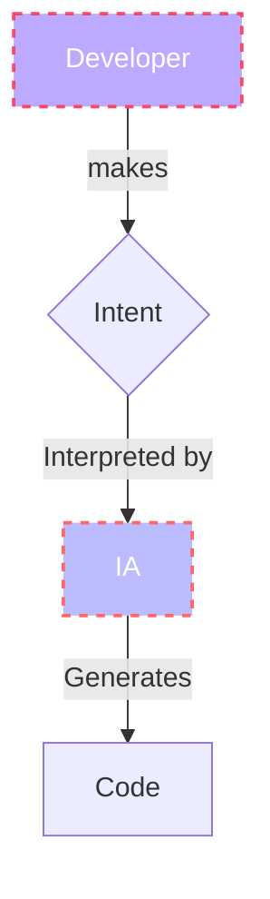
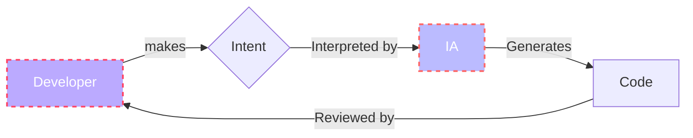

---
# You can also start simply with 'default'
theme: seriph
# random image from a curated Unsplash collection by Anthony
# like them? see https://unsplash.com/collections/94734566/slidev
background: /centro_arangoya.jpg
# some information about your slides (markdown enabled)
author: Kevin Cifuentes
title: Vibe Coding
info: |
  ## Vibe Coding
  What is Vibe Coding?
# apply unocss classes to the current slide
class: text-center
favicon: /favicon.png
# https://sli.dev/features/drawing
drawings:
  persist: false
# slide transition: https://sli.dev/guide/animations.html#slide-transitions
transition: slide-left
# enable MDC Syntax: https://sli.dev/features/mdc
mdc: true
lineNumbers: true
# open graph
# seoMeta:
#  ogImage: https://cover.sli.dev
---

# Vibe Coding

## What is Vibe Coding?

  <a href="https://github.com/Kevincifuentes/VibeCoding" target="_blank" class="slidev-icon-btn">
    <carbon:logo-github />
  </a>

<!-- Slide de apertura: qué es Vibe Coding y cómo cambia la forma de programar. Bienvenid@s y contexto general. -->
---
layout: cover
---

  

# What is <b>Vibe Coding</b>?

  <SlideCurrentNo />

<!--
Cuando hablo de Vibe Coding me refiero a describir lo que quiero como si conversara con un compañero, pero apoyándome en un modelo (LLM) que responde y me ayuda a materializar esa intención en código.

En la práctica, dejo que la IA se encargue de programar mientras yo aporto el contexto y los requisitos de lo que quiero conseguir.
-->

---
layout: two-cols
transition: fade
---

# Where <b>Vibe Coding</b> comes from?

  

- The term was coined by <b>Andrej Karpathy</b>, Tesla Copilot 👤

- Refers to <b>"Coding by conversation"</b> 💬

- Conventional coding demands: planning, precision, debugging. Vibe coding flips the coin 🪙
➕ Advantages: <b>speed</b>, <b>exploration</b>, <b>programming democratization</b> and <b>productivity boost</b> (100x Engineer)

- ⚠️ We must know it's limits

➖ Caveats: <b>works on the happy path</b>, <b>no-planning beforehand leads to not wanted or imperfect solutions </b>

::right::

    <Tweet scale="0.5" id="1886192184808149383" />

    

  <SlideCurrentNo />

<!--
El concepto viene de Andrej Karpathy y la idea de “codificar por conversación”. Yo lo presento con sus ventajas (velocidad, exploración, democratización) y también con sus límites (funciona bien en el camino feliz si no se planifica). A la derecha muestro un tuit y un diagrama con el flujo: Desarrollador → Intención → IA → Código.
-->

---
transition: fade-out
layout: quote
---

  

"It's not really coding - I just see stuff, say stuff, run stuff, and copy-paste stuff, and it <b>mostly</b> works" 

--> Andrej Karpathy

  <SlideCurrentNo />

<!--
Esta cita de Karpathy me encanta porque resume la idea: observo, pido, ejecuto y copio/pego; la mayoría de veces funciona. Aquí la uso para contrastar con la programación clásica.
-->

---
transition: fade-out
layout: section
---

  

# Vibe Coding 
# 🆚 
# AI-assisted engineering

  <SlideCurrentNo />

<!--
Voy a comparar Vibe Coding con la programación asistida por IA para abrir la conversación sobre cuándo conviene cada enfoque.
-->

---
transition: slide-up
layout: full
---

# AI assisted engineering or programming

  

 

- Opposite to Vibe Coding

- Copilot, you remain on driver's seat => <b>A new tool</b> 🔧

- Also called "plan-first" development with AI support => Define a <b>spec</b> 📝

- Treat is as your <b>intern</b>, delegate and always always <b>review</b> 👀

➕ Advantages: <b>quality</b>, <b>productivity boost with zero compromise</b>

  <SlideCurrentNo />

<!--
Aquí defino la programación asistida por IA: yo mantengo el control (copiloto), planifico primero con una especificación y trato a la IA como a un “intern”, siempre con revisión. El diagrama añade la revisión: Dev → Intención → IA → Código → Revisión. La ventaja clave para mí es calidad con productividad sostenida.
-->

---
layout: section
transition: slide-up
---

  

  <SlideCurrentNo />

## Vibe Coding VS AI assisted programming

|  |  |
| --- | --- | 
| Velocity on the short term (MVP) 🚙 | Sustained velocity 🚅
| Happy path works (POC) | Reliable 
| Solves <b>repetitive</b> tasks | Solves <b>complex</b> tasks
| Prepared to be surprised 😮 | Expectations are more measured and realistics 🎯

<b>Important </b>: They are not exclusive categories!

<!--
Para mí, Vibe Coding acelera MVP/POC y tareas repetitivas; la asistencia de IA prioriza fiabilidad y velocidad sostenida en lo complejo. No son excluyentes: combino ambos según objetivo, riesgo y horizonte.
-->

---
layout: cover
transition: fade
---

  

  <SlideCurrentNo />

# Programming by Intent

<!--
En esta sección hablo de “programación por intención”: yo explico el “qué” y delego el “cómo” al sistema o a la IA.
-->

---
layout: center
transition: fade
---

  

  <SlideCurrentNo />

# Traditional coding

* Tell the 🖥️ <b> HOW </b> to do something (algorithm)
* Use low-level implementation (code)
* Give step-by-step directions 🧭

<!--
En el enfoque tradicional yo le digo al ordenador el “cómo”: algoritmos e instrucciones paso a paso en código de bajo nivel.
-->

---
layout: center
transition: fade
---

  

  <SlideCurrentNo />

# Intent-based coding 
# (<b>prompt</b> programming)

* Tell the computer <b> WHAT </b> to do (prompt)
* Use high-level implementation (natural language) 🗣️
* Tell destination 📍 and let them figure out the best route 

<!--
Cuando programo por intención, digo el “qué” en lenguaje natural y dejo que el sistema encuentre la mejor ruta para llegar.
-->

---
layout: full
transition: fade
---

  

  <SlideCurrentNo />

# The <b>prompt</b>: where the magic begins

* It's an <b>input or question</b> you give to an AI coding system
* It's a description about <b>WHAT</b> you want the program to do rather than <b>HOW</b>
* <b>Important Skill</b> for any developer: prompt-based development
  * The better you articulate your intent, the better AI's output
* <b>LLMs ability</b>: understands the prompt to generate the code. 
  1. Understand your <b>prompt</b> (your question)
  2. Adds additional <b>context</b> to your question: your repository, your file, your attachments. 
        * Note: context (window size) has it's limit!
  3. Generates code based on probabilities learned guided by your initial prompt (doesn't think in the conventional sense)
* <b>YOU</b> remaing as validator: you can modify the previous prompt or add a new one to adapt the solution/code

<!--
Para mí el prompt es clave: cuanto mejor expreso la intención, mejores resultados obtengo. El LLM entiende mi solicitud, añade contexto (repo/archivos/adjuntos) y genera código de forma estadística. Yo valido y ajusto iterativamente.
-->

---
layout: center
transition: fade
---

  

  <SlideCurrentNo />

  
  

    <h1>Prompt programming: <b>usual flow</b> for Juniors</h1>
    <ol class="list-decimal ml-6">
      <li>Describe what you want (be clear and specific in <b>english</b>)</li>
      <li>AI generates a solution for you</li>
      <li>Review the solution, understand it</li>
      <li>Ask for clarification or explanations on that code:
        <ul class="list-disc ml-6">
          <li>why did you do it that way?</li>
          <li>what does the code do line by line?</li>
        </ul>
      </li>
      <li>If the solution is not what you expect, modify previous prompt or give clarifications.</li>
      <li>AI refines your solution with more context</li>
      <li>Repeat</li>
    </ol>
  

<!--
Así es como yo suelo trabajar con la IA: describo lo que quiero, recibo una propuesta, la reviso y, si no encaja, pido aclaraciones o ajusto el prompt. Para mí la clave es ser claro y específico, y no quedarme con la primera respuesta. También pido que explique el código paso a paso o por qué tomó ciertas decisiones; así aprendo y evito errores. Es un proceso iterativo: cada vez que doy más contexto o afino la intención, la solución mejora.
-->

---
layout: two-cols-header
transition: fade
---

  

  <SlideCurrentNo />

# Prompt programming: Why is such a big geal?

::left::

## Implications

* Boosts developer's <b>productivity</b> 📈 (10x => 100x)
* Keeps developers "in the flow" 💡
* <b>Lower barrier</b> to entry
* Changing developer <b>roles and skills</b>
* <b>Productivity</b> VS <b>Creativity</b>

::right::

## Challenges

* <b>Trust and correctness</b>. Can you trust the code an AI writes?
* Losing some <b>low-level skills</b> (solid understanding of the fundamentls is required)
* Shifting <b>job landscape</b> (less code, more system designing)

<!-- Por qué importa: productividad, flujo de trabajo y nuevas habilidades; también retos de confianza y fundamentos. -->
---
layout: cover
transition: fade
---

  

  <SlideCurrentNo />

# Tools and Models

<!--
Ahora muestro algunas herramientas para programar con prompts y comento qué implica usar distintos modelos o LLMs desde mi experiencia.
-->

---
layout: section
transition: fade-out
---

  

  <SlideCurrentNo />

## Tools

---
layout: image-right
transition: slide-up
image: /vs_code.jpeg
---

  

  <SlideCurrentNo />

# VS Code + Github Copilot

* Microsoft solution 💻
* Has major interactions:
  * Inline code autocompletion ✍️
  * Chat interface 💬
  * Agent mode 🤖
* Propietary 🔒

<!-- Copilot acelera autocompletar y chat; yo guío con una especificación y reviso siempre. -->
---
layout: image-left
transition: slide-up
image: /cline.png
---

  

  <SlideCurrentNo />

# VS Code + Cline

* Plugin on VS Code 🧩
* Excels by it's agentic approach and how displays the whole flow of judgement and reasoning 🧠
* Can be run locally, any model can be used 🏠
* Open source, you can inspect and modify it's code 🛠️

<!-- Cline destaca por el modo agente y transparencia del flujo; ideal para tareas guiadas y trabajo local. -->
---
layout: image-right
transition: slide-up
image: /cursor_ide.png
---

  

  <SlideCurrentNo />

# Cursor

* AI-first code editor (fork of VS Code) 🦾
* Understands your repository and base code 📂
* Easily integrated on your professional workflow: prompt -> review -> accept 🔄
  * You can easily reference files, assets, URLs... 🔗

<!-- Cursor entiende el repo y se integra fácil al flujo: pedir → revisar → aceptar. Muy útil en equipos. -->
---
layout: image-left
transition: fade
image: /windsurf.jpeg
---

  

  <SlideCurrentNo />

# Windsurf

* AI-driven development environment 🌊🤖
* Good with large projects 🏗️
* Indexes all the code base 🗂️

<!--
Uso Windsurf cuando trabajo en proyectos grandes. Me ayuda a indexar todo el código y a navegarlo rápido, lo que facilita muchísimo colaborar en equipos y mantenerme orientado en bases de código complejas.
-->

---
layout: section
transition: fade-out
---

  

  <SlideCurrentNo />

## Models

---
layout: full
transition: fade
---

  

  <SlideCurrentNo />

# What to consider about the Models?

* <b>Speed</b>: some take more time than others depending on the reasoning ⏩⏳
* <b>Deep reasoning</b>: they think more about the problems and solutions 🧠
* <b>Multimodal</b>: some accept only text, other's can read documents, images, links and even designs. 🖼️📄🔗
* <b>Open source</b>: some maybe free, others are propietary 🆓🔒

<!--
Aquí explico que no todos los modelos de IA son iguales: algunos son más rápidos, otros razonan mejor, y algunos son multimodales (imágenes, documentos, enlaces). También hay opciones abiertas y propietarias. Yo comparo según lo que necesita cada proyecto.
-->

---
layout: full
transition: fade
---

  

  <SlideCurrentNo />

# How to choose them? 4 questions to answer

* How much time do you have? ⏰
* How complex your problem is? 🧩
* How large is you code base (context window)? 📚
* How much money do you want to spend? 💸

<!--
Antes de elegir un modelo o herramienta, yo me hago estas preguntas clave: cuánto tiempo tengo, qué tan complejo es el problema, qué tan grande es el proyecto (context window) y con qué presupuesto cuento. Con eso tomo una decisión ajustada a mi contexto.
-->

---
layout: full
transition: fade
---

  

  <SlideCurrentNo />

# The AI Model Landscape

  

    
    
Google Gemini

    
The Multimodal Coding Powerhouse

  

  

    
    
Claude

    
The Reasoning Virtuoso

  

  

    
    
ChatGPT

    
The Versatile Companion

  

  

    
    
DeepSeek

    
Open Source Alternative

  

<!--
Aquí presento un panorama de modelos que uso o sigo de cerca: Gemini para lo multimodal, Claude para razonamiento, ChatGPT como asistente versátil y DeepSeek como opción open source. Siempre aparecen nuevos, así que me mantengo explorando.
-->

---
layout: two-cols-header
transition: fade
---

  

  <SlideCurrentNo />

  

  <SlideCurrentNo />

# AI-assisted coding: where it shines vs where it struggles

## Good for

* Zero-to-one product development 🚀
* Feature prototyping and CRUD applications 
* Glue code and integration 🔗
* Modern framework utilization 
* Repetitive code generation 🔁

::right::

## Struggles with

* Deeply complex systems 🧩
* Low-level optimizations and systems programming 🛠️
* Unique or niche frameworks 
* Creative UI/UX design 🎨
* Interpreting intent and requirements (ambiguity) 

<!--
 
Es ideal para ir de cero a uno, prototipar rápido y generar código repetitivo o de integración. 
Le cuesta más en sistemas muy complejos, optimizaciones de bajo nivel, frameworks muy nicho y cuando el diseño requiere mucha creatividad o hay ambigüedad en la intención/requisitos.
-->

---
layout: center
transition: fade
---

  

  <SlideCurrentNo />

# Bibliography
Useful resources

Addy Osmani (2025). <i>Beyond Vibe Coding: From Coder to AI-Era Developer</i>. O'Reilly Media. [Read online](https://www.oreilly.com/library/view/beyond-vibe-coding/9798341634749/)

<!-- Estos recursos son para profundizar cuando haga falta; guárdalos y vuelve cuando necesites plantillas o ideas. -->
